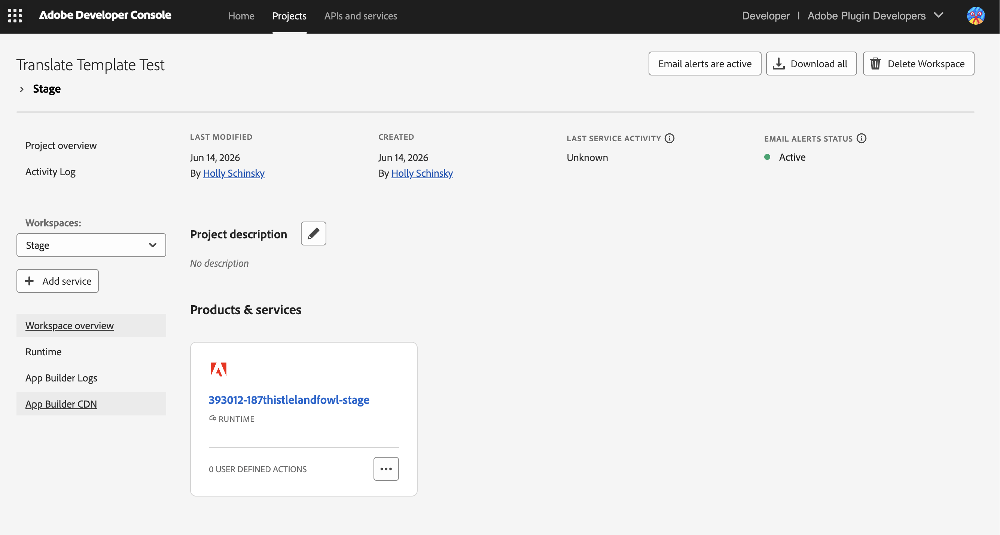

# App Builder Translation Template

Deploy a Translate connector for Adobe Express as serverless actions on Adobe I/O Runtime, using the App Builder starter template.

## What is Adobe App Builder

Adobe App Builder is a serverless application platform for extending Adobe products, deploying your code as actions to Adobe I/O Runtime with no infrastructure to provision or manage. For Translate connectors, it's one of two supported hosting paths, the Connector Playground, manifest schema, and Translate panel all work the same way either way. See [What Is App Builder?](https://developer.adobe.com/app-builder/docs/intro_and_overview/what-is-app-builder) for a deeper look at the platform.

## Standalone vs App Builder

| Concern | Standalone starter | App Builder template |
| :---- | :---- | :---- |
| Hosting | You host the HTTP server (any cloud, container, or VM) | Adobe I/O Runtime hosts the actions |
| Infrastructure ownership | You own provisioning, TLS, scaling, and uptime | Adobe manages the Runtime infrastructure |
| Deployment tool | Your own pipeline (Docker, npm scripts, IaC, etc.) | Adobe I/O CLI (`aio app deploy`) |
| Language constraint | Any language or framework | Node.js (TypeScript or JavaScript) actions |
| Local development | `npm run serve`, plus a tunnel for HTTPS Playground testing | `aio app dev` with no tunnel required |

For the standalone path, see [Getting Started](getting-started.md) and [Endpoint Setup](endpoint-setup.md). The rest of this page assumes you are using the App Builder template.

## Prerequisites

Before you continue, confirm you have the following:

- **Node.js 20 or later**, required by the template (`engines.node` is `>=20`).
- **Adobe I/O CLI**, installed globally:

  ```bash
  npm install -g @adobe/aio-cli
  ```

- **An App Builder project in Adobe Developer Console** with at least a Stage workspace. Creating the project is covered below. If your organization doesn't have App Builder enabled, or you don't see **Create project from template**, see [How to Get Access to App Builder](https://developer.adobe.com/app-builder/docs/overview/getting_access/).
- **Connector Playground access**, the same prerequisite as every Translate connector. See [Getting Started](getting-started.md#verify-connector-playground-access).

## App Builder concepts

Two distinct artifacts are both called a "template" in App Builder, and conflating them is the most common source of confusion when getting started:

- **Developer Console project template.** Selected in Adobe Developer Console when you click **Create project from template** and choose **App Builder**. This creates the cloud-side project shell, default Stage and Production workspaces, and the Adobe I/O Runtime namespace your actions will deploy into. You do not write any code in this step.
- **Local code template.** A project like `translate-connector-compatibility-service` that you download, customize, and deploy with the AIO CLI. This is the code you actually edit.

The Developer Console step creates the cloud-side environment. The local code step creates the code that runs in that environment. They are independent steps and you do them in that order.

## Create an App Builder project in Developer Console

1. Open [Adobe Developer Console](https://developer.adobe.com/console).
2. Select your organization from the org switcher.
3. Click **Create project** and choose **Project from template**, then select **App Builder**.
4. Name the project and save. Stage and Production workspaces are created automatically.

The project URL in the browser address bar follows this pattern:

```
https://developer.adobe.com/console/projects/{orgId}/{projectId}/workspaces/{workspaceId}/details
```

Note the `{orgId}` and `{projectId}` segments. You will use them in the AIO CLI commands in the next section.



## Get the template

Download and unzip [`translate-connector-compatibility-service.zip`](/static/translate-connector-compatibility-service.zip), then install dependencies from inside the unzipped folder:

```bash
npm install
```

## Connect the template to your project

Connect the local template to your Developer Console project so the CLI knows where to deploy. Use the `aio console` selection commands to choose the org, project, and workspace, then run `aio app use --global --merge --no-input` to write the configuration into your local project.

Run the commands below from inside the `translate-connector-compatibility-service` folder you just unzipped.

```bash
aio auth login

aio console org select <org-id>

aio console project select <project-id>

aio console workspace select Stage

aio app use --global --merge --no-input
```

The `aio app use --global --merge --no-input` command reads the org, project, and workspace you selected through `aio console` and writes two files into the project root:

- `.aio` contains project metadata: org, project, workspace IDs and details.
- `.env` contains runtime credentials, including `AIO_runtime_auth` and `AIO_runtime_namespace`.

To verify the context is set correctly, run `aio where`. It should print your org, project, and workspace.

<InlineAlert slots="heading, text" variant="warning" />

**Never commit `.env` to source control**

The `.env` file holds live Adobe I/O Runtime credentials. The template's `.gitignore` already excludes it. Do not remove that exclusion and do not paste `.env` contents into chat tools, screenshots, or pull requests.

For more on the CLI and App Builder onboarding, see:

- [Adobe I/O CLI on GitHub](https://github.com/adobe/aio-cli)
- [App Builder: Create your first app](https://developer.adobe.com/app-builder/docs/get_started/app_builder_get_started/first-app)
- [App Builder Runtime setup and sign-in](https://developer.adobe.com/app-builder/docs/get_started/runtime_getting_started/setup#signing-in-aio-cli)

## Template structure

The template ships with a small set of files. Group them by what you should and should not change.

```text
translate-connector-compatibility-service/
├── app.config.yaml
├── ext.config.yaml
├── extension-manifest.json
├── manifests/
│   ├── manifest-noauth.json
│   └── manifest-oauth.json
├── scripts/
│   └── oauth-pkce-test.sh
└── src/
    ├── actions/
    │   ├── auth.ts
    │   ├── feedback.ts
    │   ├── health.ts
    │   ├── locales.ts
    │   ├── locales-secure.ts
    │   ├── tones.ts
    │   ├── translation.ts
    │   └── translation-secure.ts
    └── types/
        ├── index.ts
        └── translate-connector-sdk.ts
```

### Configuration files

These files describe the Runtime package and action layout. Do not rename the required actions.

- `app.config.yaml` defines the Runtime package, action names, runtime version, memory, and env var inputs. The action names `locales` and `translate` are required by the connector API contract and must not be renamed. It also wires the OAuth-secured `locales-secure` and `translate-secure` actions, with `AUTH0_ISSUER` and `AUTH0_AUDIENCE` inputs, see [OAuth-secured action variants](#oauth-secured-action-variants) below.
- `ext.config.yaml` and `extension-manifest.json` carry extension metadata. Leave them as-is.

The snippet below is trimmed to the two required actions. The actual file also defines `health`, `tones`, `feedback`, and the OAuth-secured `locales-secure`/`translate-secure` actions using the same pattern:

```yaml
application:
    actions: actions
    runtimeManifest:
        packages:
            translation:
                license: Apache-2.0
                actions:
                    locales:
                        function: src/actions/locales.ts
                        web: "yes"
                        runtime: nodejs:22
                        inputs:
                            LOG_LEVEL: info
                        annotations:
                            require-adobe-auth: false
                            final: true
                            memory: 2048MB
                    translate:
                        function: src/actions/translation.ts
                        web: "yes"
                        runtime: nodejs:22
                        inputs:
                            LOG_LEVEL: info
                        annotations:
                            require-adobe-auth: false
                            final: true
                            memory: 2048MB
```

### Required actions

You must implement these actions for the connector to function:

- `src/actions/locales.ts` returns the locales your service supports. Update the `SUPPORTED_LOCALES` array.
- `src/actions/translation.ts` performs the translation. Replace the mock `items.map` stub with calls to your translation API.

### OAuth-secured action variants

If your manifest uses OAuth 2.0 PKCE, use these instead of the plain `locales`/`translate` actions:

- `src/actions/locales-secure.ts` and `src/actions/translation-secure.ts` are OAuth-protected copies of `locales.ts`/`translation.ts`. Each calls `verifyAuth()` first and returns `401` if the token is missing or invalid.
- `src/actions/auth.ts` exports the shared `verifyAuth()` helper. It validates the incoming `Authorization: Bearer <token>` header against your identity provider's JWKS endpoint and checks the token's issuer, audience, and expiry.
- The provider is configured through the `AUTH0_ISSUER` and `AUTH0_AUDIENCE` inputs in `app.config.yaml`. Despite the `AUTH0_` prefix, `verifyAuth()` performs standard OIDC/JWKS validation and works with any provider that exposes a `.well-known/jwks.json` endpoint (Auth0, Okta, Azure AD, and others). You can rename the inputs to match your provider, just update the matching `params.AUTH0_ISSUER`/`params.AUTH0_AUDIENCE` reads in `auth.ts`.

Once you decide which mode you're shipping, delete what you don't need: the plain `locales`/`translate` actions if you require OAuth, or `locales-secure.ts`, `translation-secure.ts`, and `auth.ts` if you don't. See [Use the OAuth-secured action variants](#use-the-oauth-secured-action-variants) for how these fit into the two-layer auth model.

### Optional actions

You can keep, customize, or delete any of these:

- `src/actions/health.ts` is recommended. The Connector Playground endpoint tester uses it to verify reachability, and it returns a `HealthResponse` (defined in [`translate-connector-sdk.d.ts`](/static/translate-connector-sdk.d.ts)).
- `src/actions/tones.ts` is needed only if your service supports tone of voice. It follows the same pattern as `locales.ts`, returning a `TonesResponse` built from a `SUPPORTED_TONES` array.
- `src/actions/feedback.ts` is recommended for collecting user feedback signals. It validates `type` and `reason` against the `FeedbackType`, `FeedbackPositiveReason`, and `FeedbackNegativeReason` enums, then returns a `FeedbackResponse`.

To remove an optional action, delete its `.ts` file and remove its corresponding entry block from `app.config.yaml`.

### Sample manifests and test scripts

- `manifests/manifest-noauth.json` is a working manifest for the no-auth path. Its `apiConfig` points at the plain `locales`/`translate` actions with `useAuth: false`.
- `manifests/manifest-oauth.json` is a working manifest for the OAuth 2.0 PKCE path. Its `authConfig` points at an Auth0 tenant, and its `apiConfig` points at `locales-secure`/`translate-secure` with `useAuth: true`.
- `scripts/oauth-pkce-test.sh` runs the full Authorization Code + PKCE exchange from the command line, outside Adobe Express, so you can confirm your OAuth setup end-to-end before connecting the Connector Playground. See [Use the OAuth-secured action variants](#use-the-oauth-secured-action-variants) below.

These sample manifests are bundled with the template for reference, not files the Connector Playground consumes directly. The Playground generates its own `manifest.json` through the form builder; use these as a model for the `authConfig`/`apiConfig` shape that pairs with each action pair.

### Type definitions

Do not modify these files. They keep your action responses aligned with the connector API contract.

- `src/types/translate-connector-sdk.ts` provides SDK types for every request and response shape. The schema matches the published [`translate-connector-sdk.d.ts`](/static/translate-connector-sdk.d.ts).
- `src/types/index.ts` provides `ActionParams` and `ActionResponse<T>` wrappers used by Runtime action signatures.

## Configure environment variables

Pass secrets and configuration to actions at deploy time using the input + env var pattern.

In `app.config.yaml`, reference env vars under `inputs`:

```yaml
inputs:
    LOG_LEVEL: info
    MY_TRANSLATION_API_KEY: $MY_TRANSLATION_API_KEY
```

The `$` prefix tells the AIO CLI to read the value from `.env` at deploy time. In `.env`:

```
MY_TRANSLATION_API_KEY=your-key-here
```

Inside an action, read the value from `params`:

```ts
const apiKey = params.MY_TRANSLATION_API_KEY as string;
```

<InlineAlert slots="heading, text" variant="warning" />

**Never hardcode secret values**

Do not put real keys in `app.config.yaml` or in any source file. Use the `$VARIABLE` reference pattern in `app.config.yaml` and store the actual values in `.env`. `.env` must remain ignored by git.

## Implement your translation logic

Each action follows the same pattern: receive `params`, do work, return an `ActionResponse<T>` whose `body` matches the connector API schema. The starter ships with stub responses that you replace with real calls to your translation provider.

### Update the supported locales

Open `src/actions/locales.ts` and replace the entries in `SUPPORTED_LOCALES` with the locales your service actually supports. The shape comes from the SDK `Locale` type and is identical to the standalone API contract. The shipped file starts with a placeholder list (`en-US`, `fr-FR`, `de-DE`, `it-IT`, `es-ES`, `th-TH`), the trimmed example below just illustrates the pattern:

```ts
import { LocalesResponse, Locale } from "../types/translate-connector-sdk";
import { ActionResponse } from "../types";

type LocalesActionResponse = ActionResponse<LocalesResponse>;

const SUPPORTED_LOCALES: Locale[] = [
    { code: "fr-FR", label: "French" },
    { code: "de-DE", label: "German" },
    { code: "es-ES", label: "Spanish (Spain)" }
];

export async function main(): Promise<LocalesActionResponse> {
    return {
        statusCode: 200,
        body: { locales: SUPPORTED_LOCALES }
    };
}
```

### Replace the translation stub

In `src/actions/translation.ts`, the stub maps each input string to a tagged copy of itself:

```ts
const result: TranslationResponse["result"] = items.map((item: string) => `[${targetLocale}] ${item}`);
```

Replace that line with a real call to your translation API. The `params` object contains any environment variables you wired up through `app.config.yaml` inputs (for example, `params.MY_TRANSLATION_API_KEY`). The example below is a complete implementation using `fetch`, not code from the template, your actual call depends on your translation provider's API or SDK:

```ts
import { TranslationResponse, TranslationRequest, ErrorCode } from "../types/translate-connector-sdk";
import { ActionParams, ActionResponse } from "../types";

type TranslationActionResponse = ActionResponse<TranslationResponse>;

export async function main(params: ActionParams): Promise<TranslationActionResponse> {
    const { sourceLocale, targetLocale, items } = params as unknown as TranslationRequest;

    if (!sourceLocale || !targetLocale || !items?.length) {
        return {
            statusCode: 400,
            body: {
                errorCode: ErrorCode.BAD_REQUEST,
                errorMessage: "Missing required parameters",
                result: []
            }
        };
    }

    const apiKey = params.MY_TRANSLATION_API_KEY as string;
    const upstream = await fetch("https://api.example.com/translate", {
        method: "POST",
        headers: {
            "Content-Type": "application/json",
            Authorization: `Bearer ${apiKey}`
        },
        body: JSON.stringify({ sourceLocale, targetLocale, items })
    });

    if (!upstream.ok) {
        return {
            statusCode: 200,
            body: {
                errorCode: ErrorCode.GENERIC_ERROR,
                errorMessage: `Upstream returned ${upstream.status}`,
                result: []
            }
        };
    }

    const data = (await upstream.json()) as { translations: string[] };

    return {
        statusCode: 200,
        body: { result: data.translations }
    };
}
```

For the full schema each action must return, see the [Translate Connector API Reference](../reference/translate-api/index.md).

## Authentication

Authentication for an App Builder Translate connector splits into two completely separate concerns. Frame them this way to avoid mixing them up:

1. Who is allowed to call your Runtime action?
2. How does your action authenticate outbound to your translation provider?

These operate at different layers and are configured independently.

### Layer 1: Who can call your Runtime action

The `require-adobe-auth` annotation in `app.config.yaml` is a Runtime gateway setting. It controls whether Adobe I/O Runtime requires a valid Adobe IMS token on the incoming request before passing it to your action code.

The template ships with `require-adobe-auth: false`. Leave it that way for an Express Translate Connectors integration. Adobe Express calls your Runtime action URL the same way it calls any connector endpoint, using the credential type configured in your manifest (OAuth 2.0 PKCE, plain API key, or none). Setting `require-adobe-auth: true` would require the caller to hold a valid Adobe IMS token, which is not part of the Express Connectors auth flow, some other Adobe I/O Runtime integrations set it to `true` when the caller is itself an Adobe product running in an IMS context, but Express Connectors always calls on behalf of an end user through connector-level auth instead.

### Layer 2: How your action authenticates to your translation service

This is the auth work you actually need to implement. Your Runtime action receives a request from Adobe Express, then makes an outbound call to your translation API. To authenticate that outbound call:

1. Store your translation API credentials in `.env`.
2. Reference them in `app.config.yaml` under `inputs` using the `$VARIABLE` pattern.
3. Read them in your action via `params.MY_API_KEY`.
4. Send them as headers or query parameters on the outbound request to your translation service.

This is entirely independent of the Runtime `require-adobe-auth` setting. Adobe Express never sees your translation API credentials, they stay server-side in Runtime.

### How Adobe Express authenticates to your connector

The connector-level auth model from [Endpoint Setup](endpoint-setup.md) applies here the same way, whether your connector runs on Runtime action URLs or a self-hosted service. When you configure auth in the Connector Playground (OAuth 2.0 PKCE, Plain API Key, or None), Adobe Express attaches those credentials to every request it sends to your connector endpoints.

Inside your action, the credential arrives on the request headers and is available via `params.__ow_headers?.authorization`. Validate it the same way you would in a self-hosted service.

### Use the OAuth-secured action variants

If your manifest uses OAuth 2.0 PKCE, don't hand-roll token validation, the template already ships a working implementation.

```ts
import { verifyAuth } from "./auth";

export async function main(params: ActionParams): Promise<LocalesActionResponse> {
    const auth = await verifyAuth(params);
    if (!auth.ok) {
        return {
            statusCode: auth.status,
            body: { locales: [], errorCode: ErrorCode.UNAUTHORIZED, errorMessage: auth.message }
        };
    }
    // ...proceed with the authenticated request
}
```

`verifyAuth()` (in `src/actions/auth.ts`) reads the `Authorization` header from `params.__ow_headers`, fetches your identity provider's JWKS, and verifies the token's signature, issuer, audience, and expiry. `locales-secure.ts` and `translation-secure.ts` call it as the first line of `main()`, so no unauthenticated request reaches your translation logic.

Point `AUTH0_ISSUER` and `AUTH0_AUDIENCE` (in `app.config.yaml`) at your identity provider, for example `https://your-tenant.us.auth0.com/` and your API identifier. The names are Auth0-flavored, but the validation logic is standard OIDC/JWKS and works with Okta, Azure AD, or any provider that exposes a `.well-known/jwks.json` endpoint.

<InlineAlert slots="heading, text" variant="info" />

**Test the PKCE flow before configuring the Connector Playground**

Run `scripts/oauth-pkce-test.sh` to exercise the full Authorization Code + PKCE exchange from the command line: it generates a code verifier and challenge, opens your provider's login page, exchanges the returned code for a token, and calls a `-secure` action with it. A `200` response confirms your issuer, audience, and `verifyAuth()` configuration all agree before you wire up the Playground.

Use `manifests/manifest-oauth.json` as a working reference for the `authConfig`/`apiConfig` shape that pairs with these actions, and `manifests/manifest-noauth.json` for the no-auth equivalent.

<InlineAlert slots="heading, text" variant="info" />

**Connector auth options are documented in Endpoint Setup**

For full details on OAuth 2.0 PKCE and API Key configuration, see [Endpoint Setup](endpoint-setup.md). The auth options and manifest configuration are the same regardless of whether your connector uses the standalone or App Builder approach.

## Local development

Start a local dev server with:

```bash
aio app dev
```

`aio app dev` runs your actions **locally** on your own machine for fast iteration. It does not deploy anything to Adobe I/O Runtime. Actions are served at URLs like:

```
http://localhost:9080/api/v1/web/translation/locales
```

<InlineAlert slots="heading, text" variant="info" />

**`aio app dev` runs locally; `aio app run` and `aio app deploy` run hosted**

Use `aio app dev` for local development only. To push your actions to Adobe I/O Runtime instead, see [Deploy to Adobe I/O Runtime](#deploy-to-adobe-io-runtime).

You can exercise each action with `curl`:

```bash
curl http://localhost:9080/api/v1/web/translation/health

curl http://localhost:9080/api/v1/web/translation/locales

curl http://localhost:9080/api/v1/web/translation/tones

curl -X POST http://localhost:9080/api/v1/web/translation/translate \
  -H "Content-Type: application/json" \
  -d '{
    "sourceLocale": "en-US",
    "targetLocale": "fr-FR",
    "items": ["Hello, world!"]
  }'

curl -X POST http://localhost:9080/api/v1/web/translation/feedback \
  -H "Content-Type: application/json" \
  -d '{ "type": "Positive", "reason": "AccurateTranslation" }'
```

CORS is not a concern during `aio app dev` testing because the Runtime gateway handles cross-origin headers for web actions. This is one operational difference from the standalone starter, which requires CORS middleware for browser-based Playground testing.

For the same `curl` patterns applied end-to-end against the deployed service, see [Test Your Service](test-your-service.md).

## Deploy to Adobe I/O Runtime

You've already selected a workspace with `aio console workspace select` (see [App Builder concepts](#app-builder-concepts)). Deploy to it:

```bash
aio app deploy
```

`aio app run` is an alternative to `aio app deploy` for this headless (backend-only) template: it deploys the package to Runtime, prints `using remote actions`, and watches your files to redeploy on change. Neither command starts a `localhost` server, both push your actions to `https://{namespace}.adobeioruntime.net/...`.

Deploy to a different workspace explicitly:

```bash
aio app deploy --workspace Production
```

List deployed actions and their public URLs:

```bash
aio runtime action list
```

Deployed action URLs follow this pattern:

```
https://{namespace}.adobeioruntime.net/api/v1/web/{package}/{action}
```

Where `{namespace}` is the value of `AIO_runtime_namespace` in your `.env` (for example, `393012-187thistlelandfowl-stage`), `{package}` is `translation`, and `{action}` is `locales`, `translate`, `tones`, `feedback`, or `health`.

<InlineAlert slots="heading, text" variant="info" />

**Deploying to Runtime is not the same as publishing an App Builder app**

The Developer Console **Submit for approval** flow described in [Publishing Your App](https://developer.adobe.com/app-builder/docs/get_started/app_builder_get_started/publish-app) applies to App Builder single-page apps listed in Adobe Experience Cloud. This Translate connector is a headless template with no UI, so that flow doesn't apply, deploying to your Production workspace above is the last App Builder-side step. What makes your connector available to Adobe Express users is the [Adobe Express submission process](submission/index.md), covered below.

## Connect to the Connector Playground

After deploying, use the deployed Runtime action URLs as your endpoint URLs in the Connector Playground. The Playground does not care whether your endpoints are a self-hosted service or App Builder Runtime URLs.

1. Open the [Connector Playground](connector-playground.md).
2. In the API Configuration section, enter the deployed Runtime URL for each endpoint. The `locales` action URL goes in the Locales endpoint field, the `translate` action URL in the Translate field, and so on.
3. Configure your auth type in the Playground to match how your action validates incoming credentials. See [Authentication](#authentication) above.
4. Use the Playground endpoint tester to verify each action responds correctly before generating the manifest.
5. Generate and save your manifest.

After endpoint URLs are configured, the rest of the connector workflow, manifest generation, end-to-end testing, and [submission](submission/index.md), is identical to the standalone path. See [Connector Playground](connector-playground.md) and [Test Your Service](test-your-service.md).

## Troubleshooting

| Symptom | Resolution |
| :---- | :---- |
| `aio: command not found` | Install the CLI: `npm install -g @adobe/aio-cli` |
| `aio app use <file>` fails with `must be object` | You passed a downloaded workspace JSON config, which is single-line format that `aio app use` cannot parse. Use the `aio console org/project/workspace select` commands followed by `aio app use --global --merge --no-input` instead. See [Connect the template to your project](#connect-the-template-to-your-project). |
| `aio where` shows no org, project, or workspace after running `aio app use --global` | Run `aio console org select`, `aio console project select`, and `aio console workspace select` first, then re-run `aio app use --global --merge --no-input`. |
| Deployment fails with missing credentials | Confirm `.env` exists and that `AIO_runtime_auth` and `AIO_runtime_namespace` are populated. Re-run `aio app use --global --merge --no-input` if either is missing. |
| Action returns `401` from the Connector Playground | Check how Adobe Express is configured to send credentials in the Playground manifest, and confirm your action validates them consistently. See [Authentication](#authentication). |
| Connector Playground cannot reach the Runtime URL | Confirm the deployment succeeded with `aio runtime action list` and that the URL in the Playground is HTTPS. |

For connector-specific issues that are not App Builder related, see [Troubleshooting](../support/troubleshooting/index.md).

## Related resources

- [Translate Connector API Reference](../reference/translate-api/index.md)
- [Endpoint Setup](endpoint-setup.md)
- [Connector Playground](connector-playground.md)
- [Test Your Service](test-your-service.md)
- [Adobe I/O CLI on GitHub](https://github.com/adobe/aio-cli)
- [What Is App Builder?](https://developer.adobe.com/app-builder/docs/intro_and_overview/what-is-app-builder)
- [App Builder: Create your first app](https://developer.adobe.com/app-builder/docs/get_started/app_builder_get_started/first-app)
- [App Builder Runtime setup and sign-in](https://developer.adobe.com/app-builder/docs/get_started/runtime_getting_started/setup#signing-in-aio-cli)
- [App Builder Architecture Overview](https://developer.adobe.com/app-builder/docs/guides/app_builder_guides/architecture_overview/architecture-overview)
- [App Builder Template Registry](https://developer.adobe.com/app-builder-template-registry/)
- [Adobe Developer Console](https://developer.adobe.com/console)
