# Connector Playground

Connector Playground is the development environment for Adobe Express Translate Connectors. Use it to configure your connector through a form builder, generate a valid `manifest.json`, and test your service end-to-end from inside Adobe Express without a production deployment.

## What Connector Playground does

Connector Playground lets you:

- Start and manage named connector sessions with cloud persistence
- Define connector metadata and endpoint configuration through a guided form builder
- Generate a `manifest.json` automatically as you fill in the form
- Validate your manifest and confirm that your service endpoints are reachable
- Connect your service and test it live in the Adobe Express Translate panel

## Access

### Enable the Connector Playground toggle

Connector Playground is available automatically to enterprise Adobe accounts with a **Developer** or **Administrator** role. Personal Adobe accounts must request access using the [Connector interest form](https://airtable.com/appiNBn2w6uT0cpkR/pag3db7joqgtwXSOv/form) before the Playground becomes available.

Once your account has access, open the Playground directly:

**[Open Connector Playground](https://www.adobe.com/go/connector-playground)**

### First-time launch: Developer Terms of Use

The first time you launch Connector Playground, a **Developer Terms of Use (DTOU)** dialog appears. You must review and accept the Adobe Express Connector Developer Terms of Use to continue. After you accept, the dialog does not appear again for subsequent sessions.

<InlineAlert slots="heading, text" variant="info" />

**Connector Playground not visible?**

The toggle is only visible to enterprise Adobe accounts with a Developer or Administrator role, or personal accounts approved through the [Connector interest form](https://airtable.com/appiNBn2w6uT0cpkR/pag3db7joqgtwXSOv/form). If the problem persists, contact [express-connectors-support@adobe.com](mailto:express-connectors-support@adobe.com).

If the direct URL does not open the Playground automatically, you can navigate to it manually:

- Steps:
  1. Sign in to [Adobe Express](https://www.adobe.com/express/) with your enterprise Adobe account, or the personal account approved through the Connector interest form.
  2. Click the **Add-ons** icon in the left rail to open the Add-ons panel.
  3. Select the **Your add-ons** tab and scroll to the bottom of the panel to find the **Add-on Development** section.
  4. Enable the **Connector Playground** toggle.

For full prerequisites, see [Getting Started](./getting-started.md#verify-connector-playground-access).

## Playground UI overview

When open, Connector Playground runs as a panel docked at the bottom of Adobe Express.

It can be minimized to a pill in the bottom bar when you need more of the editor in view.

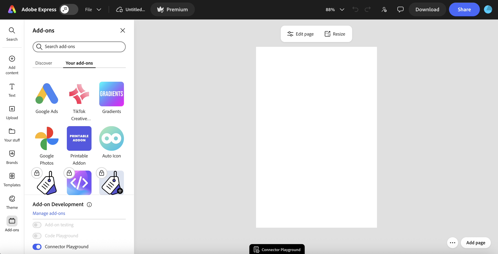

Click the pill tab to reopen the Playground from its minimized state. You can also expand the Playground to full view using the **Expand** button in the top-right corner.

The Playground UI has three main areas. For top-right controls (More, Minimize, Expand, Close, Copy, and Connect), see [Playground Controls](#playground-controls).

### Title bar

The title bar runs across the top of the Playground and shows:

- **Connector Playground**: the Playground mode label and icon
- **Session name**: the editable name of the current session (for example, "Untitled - 07 Apr 2026 at 09.51.39"). Click the name to rename it.
- **Saved**: a status indicator that confirms your session configuration is saved to the cloud

### Form builder panel (left)

The collapsible form builder on the left is the primary authoring surface. As you fill in fields, the manifest JSON on the right updates in real time. The four sections are:

- **General**: connector identity fields (`id`, `name`, `type`, `version`, and app targets)
- **Authentication Configuration**: the authentication type for your connector and its required fields
- **API Configuration**: endpoint URLs, HTTP methods, headers, body, path parameters, query parameters, and per-endpoint authentication toggle
- **UI Configuration**: Translate panel controls, form input definitions, data sources, and labels

### Manifest JSON panel (right)

The right panel displays the manifest JSON generated from your form builder inputs. This panel is **read-only**: you cannot paste or edit JSON directly. All changes must go through the form builder.

## Form builder

The form builder is the only way to configure your connector in the Playground. It produces a valid manifest from your inputs without requiring you to write or edit JSON directly.

### Walkthrough: Configure your connector

Fill in the four sections in order. The manifest JSON panel on the right updates in real time as you type.

1. In the **General** section, enter your connector **Connector ID**, **Connector Name**, **Connector Type** (`Translate`), and **Version**. The `apps`, `manifestVersion`, and `connectorVersion` fields are set automatically.

2. In the **Authentication Configuration** section, select your auth type: **None**, **OAuth 2.0 PKCE**, or **API Key**. Fill in the required fields for your choice. The auth type you select here applies to every endpoint where you enable **Use authentication** in the next step.

<InlineAlert slots="heading, text" variant="info" />

**Testing against a service on your local machine**

Adobe Express runs over HTTPS and the Playground's endpoint tester calls your service directly from the browser. Plain `http://localhost` URLs may work in Chrome and Edge as a development convenience, but they are not portable: Safari blocks them outright, and browser mixed-content rules can vary across versions and Adobe Express environments. Treat any `http://localhost` success as best effort, not as a supported path. OAuth `authorizationUrl` and `tokenUrl` values almost always require HTTPS, both for Adobe Express and for your authorization server.

The reliable way to test the Playground against a service running on your machine is to expose it over HTTPS. Common options:

- A tunneling tool such as [ngrok](https://ngrok.com/), [Cloudflare Tunnel](https://developers.cloudflare.com/cloudflare-one/networks/connectors/cloudflare-tunnel/), or `cloudflared`, each of which gives you a public HTTPS URL that forwards to your local port.
- A local HTTPS reverse proxy with a trusted certificate, for example [mkcert](https://github.com/FiloSottile/mkcert) paired with Caddy or nginx.

Enter the HTTPS URL the tunnel or proxy provides (for example, `https://your-subdomain.ngrok-free.app/locales`) in the API Configuration form. Use the same hostname for `authorizationUrl` and `tokenUrl` if you are configuring OAuth 2.0 PKCE.

3. In the **API Configuration** section, add an entry for each endpoint your service implements. Enter the full URL and HTTP method for each, and enable **Use authentication** on any endpoint that should include credentials. At minimum, add entries for `locales` and `translate`.

4. In the **UI Configuration** section, set the entrypoint **Title** and add your form inputs:
   - **Locale picker (required):** Input ID `targetLocale`, Input Type `MultiSelectPicker`, Data Source `API`, API endpoint `locales`.
   - **Tone picker (optional):** Input ID `tone`, Input Type `Picker`, Data Source `API`, API endpoint `tones`. Omit if your service does not support tones. The tone picker only appears in the Translate panel after the user selects at least one locale, matching the behavior of the native Adobe Express Translate panel.

5. Resolve any validation errors flagged with a red underline before proceeding. Hover over any underlined field to read the specific error message.

6. Select **Connect**. The Playground validates the manifest and confirms each endpoint is reachable. A green success toast confirms your connector is live in the Translate panel.

For full field-level details on each section, see the subsections below.

### General section

Configure the top-level identity fields for your connector. The form uses human-readable labels that map to the corresponding manifest keys shown below:

| Form label | Manifest key | Required | Notes |
| :---- | :---- | :---- | :---- |
| Connector Name | `name` | Yes | Display name shown in the Adobe Express UI. Letters, numbers, and spaces only (no hyphens or special characters). Must start with a letter or number. 3-31 characters. |
| Connector Type | `type` | Yes | Dropdown. Always `"Translate"`. |
| Version | `version` | Yes | Semantic version string in `major.minor.patch` format (for example, `1.0.0`). |
| Connector ID | `id` | Yes | Unique connector identifier. Letters, numbers, and hyphens only. 2-30 characters. Must be globally unique across all connectors. May appear below the visible fields; scroll down if you do not see it. |

The `apps`, `manifestVersion`, and `connectorVersion` fields are set automatically by the Playground and do not appear as editable fields. See [Top-level identity fields](../reference/manifest-schema/index.md#top-level-identity-fields) in the Manifest Schema Reference for their values and constraints.

### Authentication Configuration section

The Authentication Configuration section sets the auth method for your entire connector. The choice you make here applies to every endpoint where you enable the **Use authentication** toggle in the API Configuration section. You cannot use different authentication types for different endpoints.

Select an **Authentication Type** from the dropdown:

| Type | When to use |
| :---- | :---- |
| **None** | No authentication. Your service receives requests with no `Authorization` header. Use for local development, network-protected services, or custom auth outside the manifest. |
| **OAuth 2.0 PKCE** | Each user authorizes your service with their own account. Adobe Express opens a popup to your authorization URL and exchanges the code for a token. Production approved. |
| **API Key** | A single static key shared across all users. You enter the key here; then reference it via the `$apiKey` placeholder in each endpoint's headers in the API Configuration section below. **Development and testing only**: the key is stored in plain text in your manifest and is not approved for production. See [Endpoint Setup: authentication options](./endpoint-setup.md#choose-your-authentication-type) for what's approved for production. |
| **Secure API Key** | A single static key shared across all users, stored server-side by Adobe and injected at request time. Production approved. **This round, the Playground supports Secure API Key for manifest generation only**: selecting it produces a manifest with the correct schema, but you cannot Connect or test end to end with it yet. See the [Secure API Key](#secure-api-key) subsection below for the recommended flow. |

**OAuth 2.0 PKCE fields** (required when OAuth 2.0 PKCE is selected):

| Field | Notes |
| :---- | :---- |
| Authorization URL | The URL where users authorize your service. Must use HTTPS. |
| Token URL | The URL Adobe Express calls to exchange the authorization code for an access token. Must use HTTPS. |
| Client ID | Your OAuth 2.0 client identifier registered with your authorization server. |
| Scope | Space-separated list of OAuth scopes your service requires. |
| Additional Params | Optional. Extra key-value pairs passed to your authorization URL for provider-specific requirements (for example, `audience` for Auth0 or `resource` for Azure AD). |

The OAuth 2.0 PKCE fields are mapped to the corresponding API Configuration section fields:

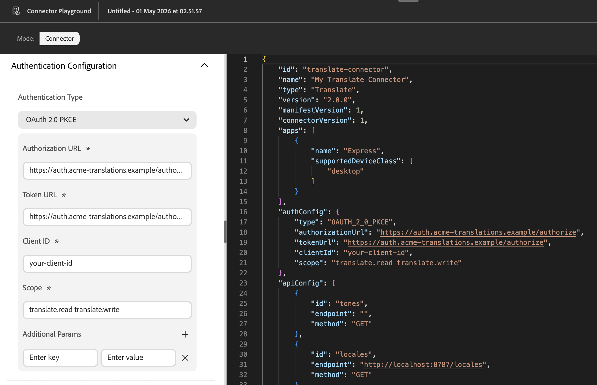

**API Key field** (required when API Key is selected):

| Field | Notes |
| :---- | :---- |
| API Key | The static key value. Stored in `authConfig.apiKey` and injected wherever `$apiKey` appears as a header value in your endpoint configuration in the API Configuration section. **Stored in plain text in your manifest, which is distributed to client devices: do not paste a production secret here.** Use a key scoped to the minimum permissions required, and rotate it if it's ever exposed. Plain API Key is supported in the Playground for development and end-to-end testing; for production, use OAuth 2.0 PKCE or Secure API Key. See [Endpoint Setup](./endpoint-setup.md#option-2-plain-api-key-development-and-testing-only). |

When **None** is selected, no additional fields are shown. `authConfig` is omitted from the generated manifest entirely.

#### Secure API Key

When **Secure API Key** is selected, no key input field appears. `authConfig` becomes `{ "type": "SECURE_API_KEY" }` automatically. You then manually add `$secureApiKey` as the header value for any authenticated endpoint in the API Configuration section, the same way you would add `$apiKey` for a plain API Key connector.

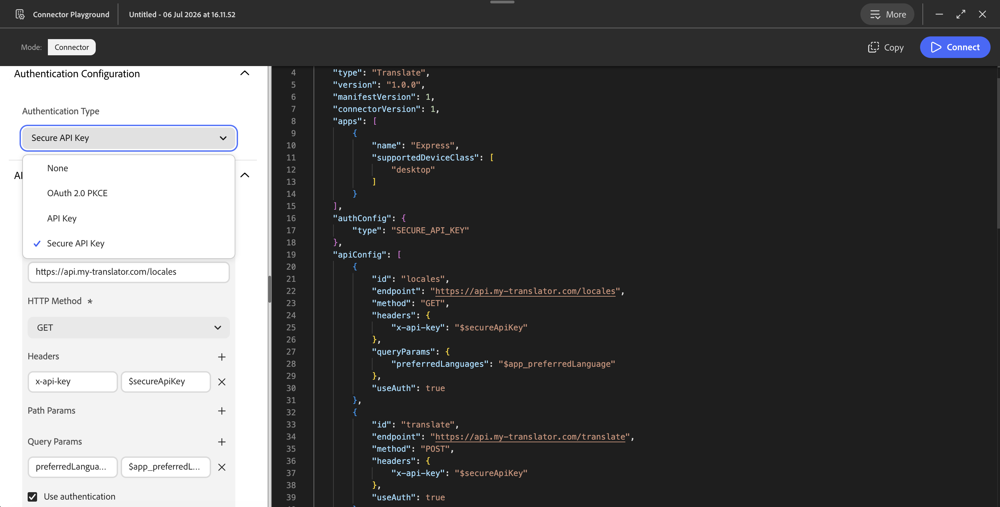

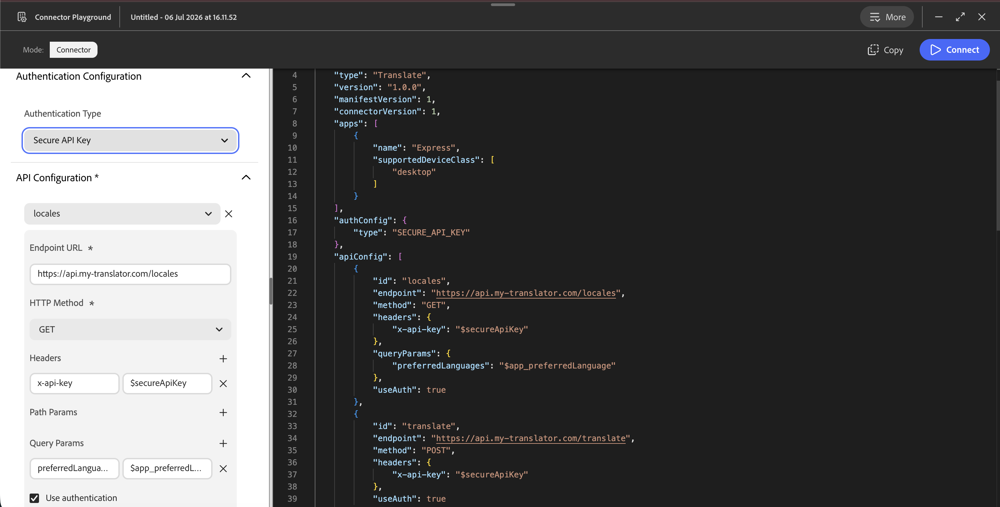

<InlineAlert slots="heading, text" variant="warning" />

**Secure API Key cannot be tested end to end in the Playground in this release**

Selecting Secure API Key generates a manifest with the correct schema, but the Playground cannot exercise Adobe's secure bridge yet, so **Connect** will not validate a Secure API Key connector end to end. Follow this flow instead:

1. Configure and test your connector with **API Key** in the Playground until the end-to-end flow works as expected.
2. Once testing is complete, switch **Authentication Type** to **Secure API Key**. This regenerates `authConfig` and clears the plain key value.
3. Go straight to **More > Download code** to save the manifest. Do not select **Connect** or **Reconnect** after switching: there's nothing for it to validate.
4. Upload that manifest through the [submission portal](./submission/index.md). Creating a listing, private, internal, or public, is what assigns and registers your connector ID with Adobe.
5. Follow the registration and handoff steps in [Register your Secure API Key with Adobe](./submission/index.md#register-your-secure-api-key-with-adobe) to complete setup with the Adobe team.

For help choosing an authentication type and implementing token validation in your service, see [Endpoint Setup](./endpoint-setup.md).

### API Configuration section

Configure the endpoints Adobe Express calls during the translation workflow. Use the endpoint dropdown at the top of the section to switch between your configured endpoints. Select the **+** icon to add a new endpoint entry, or the **X** to remove one.

For each endpoint, configure:

| Field | Required | Notes |
| :---- | :---- | :---- |
| Endpoint URL | Yes | The full URL of your service endpoint. HTTPS is required for reliable Playground testing and for production. See [Testing against a service on your local machine](#walkthrough-configure-your-connector) above for how to expose a local service over HTTPS. |
| HTTP Method | Yes | `GET` or `POST`. Only these two methods are accepted. |
| Headers | No | Static key-value pairs included with every request to this endpoint. |
| Body | No | Static key-value pairs added to the request body. Only applies to POST endpoints; ignored for GET. |
| Path Params | No | Path parameter substitutions for URL placeholders in `:paramName` format. The value replaces the placeholder in the endpoint URL before the request is sent. |
| Query Params | No | Key-value pairs appended as query string parameters. Supports dynamic value prefixes (see below). |
| Use authentication | No | When checked, Adobe Express includes the credentials from the Authentication Configuration section with requests to this endpoint. Corresponds to `useAuth: true` in the manifest. |

**Dynamic value prefixes** in Query Params, Headers, Body, and Path Params values:

| Prefix | What it resolves to | Example |
| :---- | :---- | :---- |
| `$app_preferredLanguage` | The user's preferred display language from their Adobe Express settings (for example, `fr-FR`). Use this on your `/locales` and `/tones` endpoints so labels are returned in the user's language. | `"preferredLanguage": "$app_preferredLanguage"` |

The Translate connector type requires `apiConfig` entries with `id` values of `"locales"` and `"translate"`. Entries for `"health"`, `"tones"`, and `"feedback"` are optional but recommended. For the full list of field constraints and endpoint requirements, see the [Manifest Schema Reference](../reference/manifest-schema/index.md).

<InlineAlert slots="heading, text" variant="info" />

**Only `locales` and `tones` can drive panel pickers**

Currently, only the `locales` and `tones` API endpoints can populate form input pickers in the Translate panel. You can still define endpoints with other ids (for example `categories`), and your service may call them on its own, but their responses are not sent in the `/translate` request and cannot be bound to a picker. Support for additional parameters will be added on a per-partner basis as the allow list expands. If you need this for your integration, contact [express-connectors-support@adobe.com](mailto:express-connectors-support@adobe.com).

<InlineAlert slots="text" variant="info" />

The **Data Source API ID** dropdown in the UI Configuration section is populated from the endpoint ids you define here. Configure your API endpoints before defining form inputs that reference them with an API data source.

### UI Configuration section

The UI Configuration section defines how Adobe Express renders the Translate panel controls for your connector. For Translate connectors, `uiConfig` is required.

The section has two top-level fields, followed by one or more form input cards:

| Field | Required | Notes |
| :---- | :---- | :---- |
| Description | No | Short text describing your connector, shown in the Adobe Express UI. Maps to `uiConfig.description`. |
| Title | Yes | The label shown on the entrypoint in the Translate panel. Maps to `uiConfig.entrypoints[].label`. |

Each form input card defines one control in the Translate panel. Use the **+** icon to add an input, or the **X** to remove one. Each card contains:

| Field | Required | Notes |
| :---- | :---- | :---- |
| Input ID | Yes | A unique identifier for this form input. The locale picker **must** use `targetLocale` exactly (validated at Connect time). The tone picker **must** use `tone` exactly: any other id is silently ignored by the Translate panel and the picker will not render, even though Connect validation will still pass. No two inputs within the same entrypoint can share the same id. |
| Input Type | Yes | `Picker` (single-select) or `MultiSelectPicker` (multi-select). Both require a data source. Use `MultiSelectPicker` for the locale picker and `Picker` for the tone picker. |
| Data Source Type | Yes | `Static` or `API`. |
| (Static) Options | When Static is selected | The inline list of options. Each row has a **Value** (what is sent in the API request), a **Label** (what the user sees in the dropdown), and an optional **Group** (groups options under a shared heading in the dropdown). |
| (API) Data Source API ID | When API is selected | The endpoint whose response populates this picker. Select from the endpoint ids you configured in the API Configuration section. The `$api_` prefix is added automatically in the manifest. |
| Label | No | The visible label shown above this control in the Translate panel. |
| Placeholder | No | The placeholder text shown inside the control when no value is selected. |
| Value | No | A predefined default value for the input. |
| Required | No | When checked, the user must select a value before translating. Maps to `attributes.required: true`. |
| Read-only | No | When checked, the input is displayed but the user cannot change the value. Maps to `attributes.readonly: true`. |
| Max Items | MultiSelectPicker only | The maximum number of values a user can select. Maps to `attributes.maxItems`. |

**Locale picker (required):** Add a form input with Input ID `targetLocale` and Input Type `MultiSelectPicker` to let users translate to multiple locales at once. Set the Data Source Type to `API` and select your `locales` endpoint, or use `Static` to define a fixed list of locales inline. The Translate panel will not render without a valid `targetLocale` form input.

**Tone picker (optional):** Add a form input with Input ID `tone` and Input Type `Picker`. Set the Data Source Type to `API` and select your `tones` endpoint, or use `Static` to define tones inline. Omit the tone picker entirely if your service does not support tones.

<InlineAlert slots="heading, text" variant="info" />

**The tone picker only appears after a locale is selected**

The Translate panel hides the tone picker until the user selects at least one locale, matching the behavior of the native Adobe Express Translate panel. This avoids prompting users for a tone before they've committed to translating. Test this flow end to end after connecting: open the panel, confirm the tone picker is hidden, select a locale, and confirm the tone picker then renders below the locale picker.

Adobe Express renders the Translate panel UI based on your `uiConfig`. Your `/locales` and `/tones` endpoint responses populate the picker options at runtime. For the expected response shapes, see [Endpoint Setup](./endpoint-setup.md#implementing-the-endpoints).

<Columns slots="image, heading" repeat="2" />

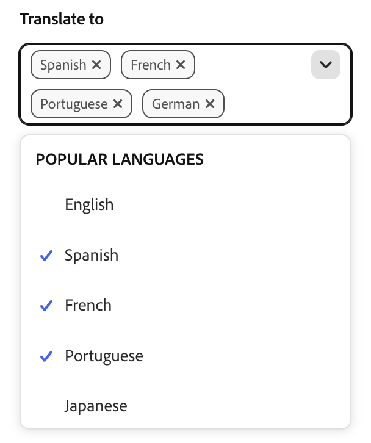

Example of a Locale "MultiSelectPicker" component populated with grouped categories from your `/locales` response

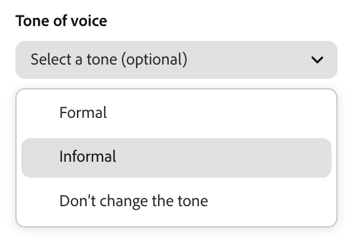

Example of a Tone "Picker" component populated from your `/tones` response

## The Connect loop

**Connect** does not validate Secure API Key connectivity. It only works against services using **None**, **OAuth 2.0 PKCE**, or **API Key**. If your connector uses Secure API Key, skip Connect and go straight to **More > Download code** once you've tested with API Key. See [Secure API Key](#secure-api-key) above.

**Connect** is the primary action in the Playground. Selecting it validates your manifest and connects your local service to Adobe Express for end-to-end testing. Most of your development time in the Playground will follow this loop: adjust form inputs, Connect, test in the Translate panel, then repeat. After the first successful connect, the button is relabeled **Reconnect** and runs the same validate-and-connect flow whenever you change your configuration.

### What Connect does

When you select **Connect**, the Playground:

1. Validates the manifest against the connector schema. If validation fails, errors are shown before any network requests are made.
2. Checks that each configured service endpoint is reachable. If your connector uses OAuth 2.0 PKCE, an authorization dialog opens at this point so you can log in and grant access before endpoint checks proceed.
3. If any endpoint is unreachable, displays a **red badge** indicating how many errors were found and a red toast notification that the endpoint tests failed.

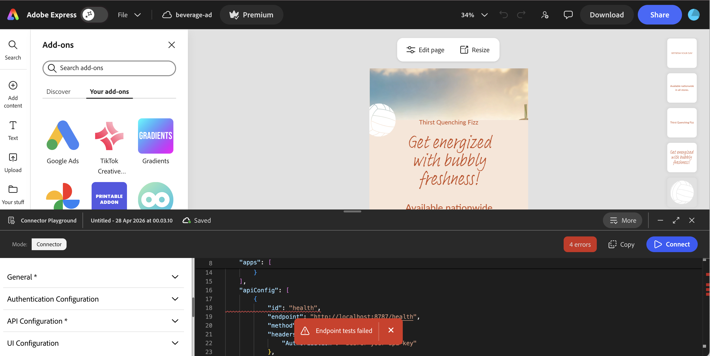

Errors surface in two places:

- **In the UI:** invalid or unreachable fields are flagged with a red squiggly line. Scroll through the form to find them and hover over any underlined field to read the specific error message.
- **In the browser console:** all Playground activity is logged to your browser's developer tools with a `playground` prefix. Open the console to inspect raw request and response details when errors are not obvious from the UI alone.

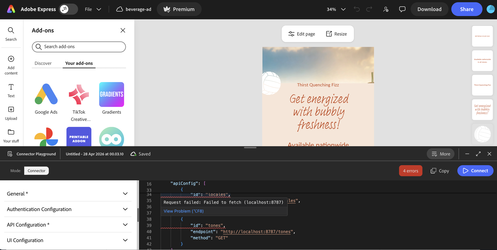

If a manifest validation error is detected, it will also be flagged with a red badge and inline error message.

<InlineAlert slots="heading, text, image" variant="tip" />

**Tip**

It's easier to find and fix multiple errors when the Playground is expanded to full view.

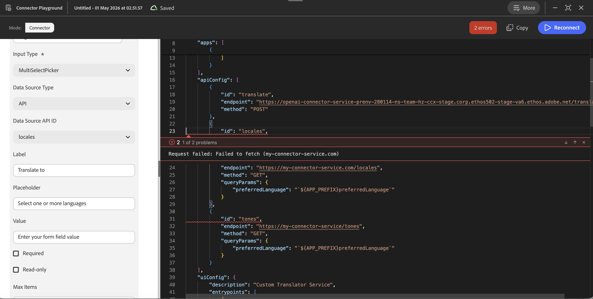

4. Once all errors are resolved and all endpoints are reachable, Connect shows a green success toast:

   > *"You are connected, you should now be able to choose your service in the Translate panel."*

5. Your connector service is now available in the Translate panel for testing.

### Testing in the Translate panel

After a successful connection, minimize the Connector Playground using the minus (-) button in the upper right corner, then open the Translate panel in Adobe Express.

To open the Translate panel, click **Edit Page** in the editor and select the Translate icon as shown below:

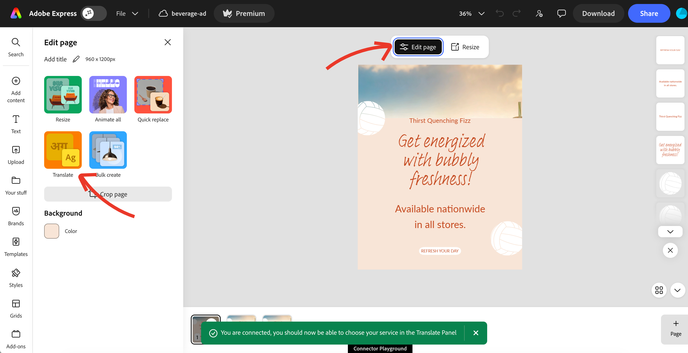

Your connector appears in the **Translation service** dropdown marked with an "In development" icon to distinguish it from production services.

<Columns slots="image, heading" repeat="1" isReversed="true" />

Example of "In development" connector in the Translate service dropdown.

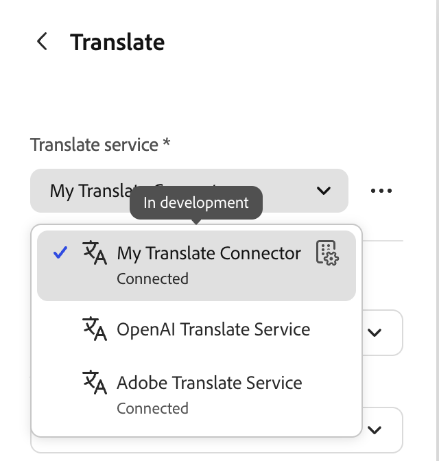

Select your service, verify that the locale and tone pickers are populated correctly, and click **Translate** to run a test translation.

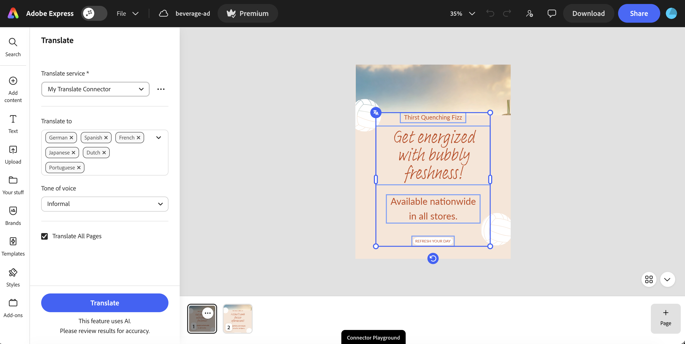

Verify:

- The locale picker is populated with the locales returned by your `/locales` endpoint. If your endpoint returns a `category` field on each locale, options are grouped by category in the picker.
- If the tone picker was configured, it is populated with the values from your `/tones` endpoint.
- Locale and tone labels are correct and readable.
- After translation completes, Adobe Express creates one translated page per target locale in the correct order.
- When multiple target locales are selected using `MultiSelectPicker`, Adobe Express sends one `/translate` request per locale. Plan your service for concurrent requests and ensure response times are acceptable at that scale.

<InlineAlert slots="heading, text" variant="info" />

**Stale dropdown data after updating your service**

Adobe Express caches `/locales` and `/tones` responses in memory for the current session. If you update your service (for example, add or remove locales) and the picker still shows the old options after reconnecting, do a hard reload of Adobe Express (`Cmd+Shift+R` / `Ctrl+Shift+R`), then select **Connect** again. The fresh page load clears the in-memory cache and forces a new call to your endpoints.

#### Translated pages output

After translation completes, Adobe Express creates one new page per selected target locale, in the order the locales were selected. The example below shows the source page followed by six translated pages (German, Spanish, French, Japanese, Dutch, and Portuguese) generated from a single Translate action with six locales selected in the `MultiSelectPicker`.

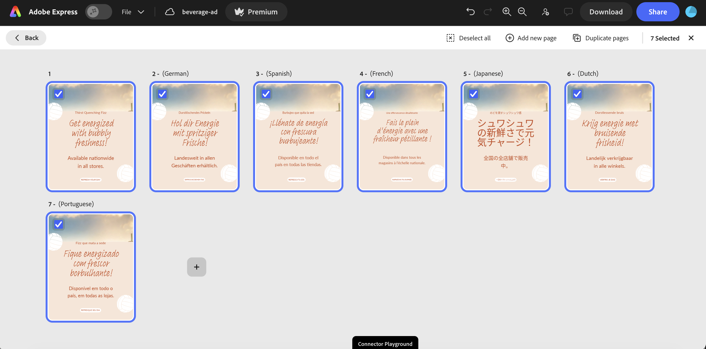

Use the Playground console output (visible in your browser's developer tools, prefixed with `playground`) to debug request and response behavior if anything looks wrong.

### Disconnect behavior

- **Closing the Playground** automatically disconnects your local connector session. The session configuration is saved and can be resumed, but the connector is no longer active in the Translate panel.
- **Selecting Disconnect from the Translate panel** disconnects the connector and returns the Playground to the **Connect** state. Use this to reset the connection without closing the Playground.

### Common reasons for failure

| Failure | Common cause | Next step |
| :---- | :---- | :---- |
| Manifest validation error | Missing required field or invalid field type | Review the error detail shown in the Playground and compare against the [Manifest Schema Reference](../reference/manifest-schema/index.md) |
| Service unreachable | Incorrect URL, service not running, or TLS certificate issue | Confirm the endpoint responds with `curl` before reconnecting |
| Invalid response payload | Endpoint response doesn't match the expected contract | Check response shapes against the [Translate Connector API Reference](../reference/translate-api/index.md) |
| Auth mismatch | Auth configuration in the manifest doesn't match service requirements | Verify `authConfig` and `useAuth` settings in [Endpoint Setup](./endpoint-setup.md) |

For more details and diagnostic steps, see the [Troubleshooting guide](../support/troubleshooting/index.md).

## Playground Controls

### Top-right controls

| Control | Description |
| :---- | :---- |
| **More** | Opens the More menu. See [More menu](#more-menu) below. |
| Minimize | Collapses the Playground to a pill at the bottom of the canvas. |
| Expand | Opens the Playground in a larger view. This is useful when you need more space to configure your connector. |
| Close (X) | Closes the Playground. A confirmation dialog appears before closing to prevent accidental loss of context. |
| **Copy** | Copies the current manifest JSON to the clipboard. |
| **Connect** / **Reconnect** | Validates the manifest and connects your service. The button is labeled **Connect** on first use; after a successful connect, it switches to **Reconnect** for the rest of the session and is used to re-run the same validate-and-connect flow after you change form inputs. See [The Connect loop](#the-connect-loop). |

### More menu

Select **More** in the top-right corner to access session and utility options:

| Menu item | Description |
| :---- | :---- |
| **Manage session** | View and switch between your saved connector sessions. Only connector sessions are shown when accessed from within Connector Playground. |
| **Start a new session** | Creates a new connector session with a blank configuration. |
| **Download code** | Downloads the generated `manifest.json` for your current session. |
| **View docs** | Opens the Adobe Express Translate Connectors developer documentation. |

### Sessions

Connector Playground supports multiple named sessions with cloud persistence. Each session stores a complete connector configuration independently.

- **Cloud persistence:** sessions are saved automatically as you make changes. The **Saved** indicator in the title bar confirms the latest state is stored.
- **Renaming:** click the session name in the title bar to rename it. Use a descriptive name to distinguish sessions when you have multiple connector configurations.
- **Switching sessions:** use **More > Manage session** to view all saved sessions and switch between them. Only Connector Playground sessions appear in this view.
- **Starting fresh:** use **More > Start a new session** to create a new blank session without affecting existing ones.

<InlineAlert slots="heading, text" variant="warning" />

**Sessions are subject to a retention policy**

Sessions that have been inactive for a period of time are deleted. Before pausing work on a connector, use **More > Download code** to save a copy of your `manifest.json` locally. This ensures you can restore your configuration even if the session is removed.
