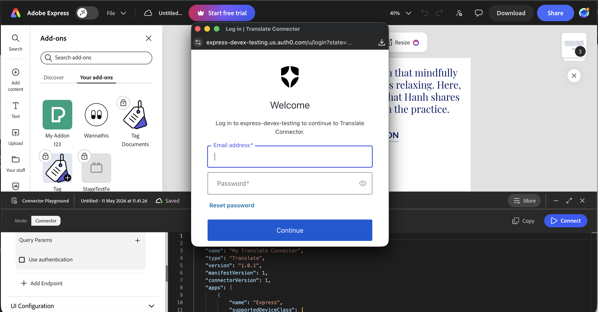
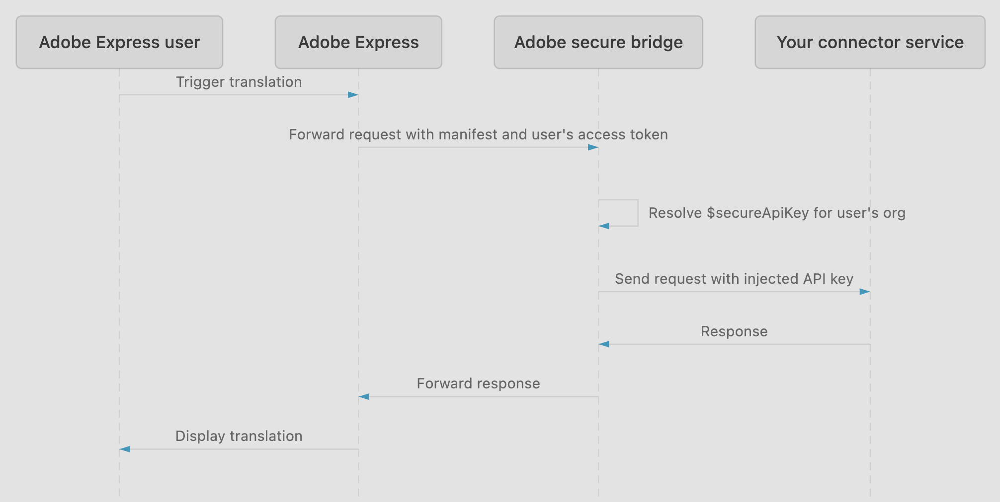

# Endpoint Setup

This guide walks you through the different authentication methods and how to use them along with the spec reference and sample code to help you write your translation endpoints logic and run some basic testing.

## The five endpoints at a glance

The table below lists all five endpoints. The first four are listed in the order Adobe Express calls them during a translation session. `/health` is not part of the runtime flow and is listed separately.

We also recommend checking out the [starter project](getting-started.md#use-the-starter-project) for an example implementation of all five endpoints.

| Method | Endpoint | Required? | When called | Notes |
| :---- | :---- | :---- | :---- | :---- |
| `GET` | `/locales` | Optional (recommended) | On Translate panel open | Populates the target language dropdown. If omitted, Adobe Express falls back to its built-in locale list. |
| `GET` | `/tones` | Optional  (recommended) | On Translate panel open, in parallel with `/locales` | Only called if your manifest declares a tones API endpoint. Omit if your service does not support tones. |
| `POST` | `/translate` | **Required** | When the user triggers a translation | The only required endpoint. |
| `POST` | `/feedback` | Optional (recommended) | After translation, when the user submits a rating | Receives thumbs up/down feedback. Omit if you do not need feedback data. |
| `GET` | `/health` | Optional (recommended) | During Connector Playground setup only | Used by the Playground endpoint tester to verify your service is reachable. Not called during normal Adobe Express runtime. |

The first thing you should do before building your translation connector service, is choose an authentication method. Adobe Express Translate Connectors support four authentication options: OAuth 2.0 PKCE, Secure API Key, plain API Key (development and testing only), and no authentication. Continue below to understand each option, what to configure in your service, and what you can test locally right now, versus what requires the Adobe Express Connector Playground access to test end-to-end.

## Choose your authentication type

| Auth type | When to use | Production approved? |
| :---- | :---- | :---- |
| **OAuth 2.0 PKCE** | Each user authorizes your service with their own account. Best when data or permissions are user-scoped (for example, a translation service that bills per user or stores per-user preferences). | Yes |
| **Plain API Key** | A single static key is shared across all users. Use during development and end-to-end testing in the Connector Playground when standing up OAuth would slow you down. | **No, development and testing only** |
| **Secure API Key** | A single static key shared across all users, stored server-side by Adobe and injected at request time. The key never appears in your manifest or on client devices. Intended for backend services that treat all Adobe Express users the same. | Yes |
| **None** | Your service is protected at the network level (IP allowlisting), you're running locally for development only, or you handle authorization through a custom mechanism. | Service-dependent |

The auth type you select applies uniformly to every endpoint in your connector. You cannot mix types (for example, API Key for `/locales` and `/tones` with OAuth 2.0 PKCE for `/translate`). Endpoints that should include credentials are marked with `useAuth: true` in the `apiConfig`; see the [Manifest Schema Reference](../reference/manifest-schema/index.md) for the field-level details.

<InlineAlert slots="heading, text" variant="warning" />

**Plain API Key is not approved for production**

Plain API Key is a development and testing convenience, not a production option. Adobe Express stores plain API Key values in the manifest, which is distributed to client devices, so any plain key is effectively public. For production, choose OAuth 2.0 PKCE when each user must authorize with their own account, or [Secure API Key](#option-3-secure-api-key) when you need a static-credential model with the key stored server-side by Adobe.

### Option 1: OAuth 2.0 PKCE

OAuth 2.0 PKCE (Proof Key for Code Exchange) gives each user their own authorization session. When a user connects to your service from the Connector Playground or the production Translate panel, Adobe Express opens a popup to the `authorizationUrl` defined in your manifest. After the user completes the flow, Adobe Express exchanges the authorization code for an access token using the `tokenUrl` from your configured manifest and includes that token in every subsequent API call.

#### Register the redirect URIs

When registering your OAuth application with your authorization server (Auth0, Okta, Azure AD, or any other provider), you must allowlist the redirect URIs that Adobe Express uses after the user completes authorization. Add **both** of the following:

```
https://express.adobe.com/static/oauth-redirect.html
https://new.express.adobe.com/static/oauth-redirect.html
```

Adobe Express is in the process of migrating from `new.express.adobe.com` to `express.adobe.com`. If you allowlist only one, OAuth will fail for users on the other domain. Register both now, even if you're not ready to test the full flow yet.

#### OAuth popup flow

When a user clicks **Connect** in the Connector Playground (or selects your service in the production Translate panel for the first time), Adobe Express opens a popup window to the `authorizationUrl` from your manifest. The user signs in on your authorization server, grants the scopes you've requested, and the popup closes automatically once authorization completes. Adobe Express then exchanges the authorization code for an access token using your `tokenUrl` and stores the token for use on subsequent API calls.



The login form shown in the popup is rendered by your authorization server, not by Adobe Express. The exact layout, branding, and fields will match whatever your provider serves at the `authorizationUrl`.

After the popup closes, the Playground shows a green "successfully connected" toast and the connector becomes available in the Translate panel. If you see a red error toast instead, or the popup shows a provider error page that does not close, see [Troubleshooting: Authentication errors](../support/troubleshooting/index.md#authentication-errors).

#### PKCE code challenge method

Adobe Express uses `code_challenge_method=S256` (SHA-256) when generating the PKCE code challenge. Your authorization server must support the `S256` method. Most major providers (Auth0, Okta, Azure AD, Google) support `S256` by default, but verify your configuration - some servers require it to be explicitly enabled or set as the required method. The `plain` challenge method is not used and should not be accepted as a fallback.

#### How Adobe Express sends the access token

After a successful token exchange, Adobe Express sends the access token in the `Authorization` header of every API call to endpoints where you've configured authentication to apply when you build your manifest. 

```
Authorization: Bearer <access_token>
```

#### Token validation sample

Your service must validate this token on every protected request. The following example is written for the TypeScript starter project (`translate-connector-standalone`), but the same pattern applies in any language:

```ts
import express, { Request, Response, NextFunction } from "express";

function requireBearerToken(req: Request, res: Response, next: NextFunction) {
  const authHeader = req.headers["authorization"];
  if (!authHeader || !authHeader.startsWith("Bearer ")) {
    res.status(401).json({ errorCode: "Unauthorized", errorMessage: "Missing or invalid Authorization header" });
    return;
  }
  const token = authHeader.slice("Bearer ".length);

  // Replace with your authorization server's token introspection
  // endpoint or local JWT verification logic.
  if (!isValidToken(token)) {
    res.status(401).json({ errorCode: "Unauthorized", errorMessage: "Token validation failed" });
    return;
  }
  next();
}

// Apply to protected routes. /health typically does not require auth.
app.get("/locales", requireBearerToken, (req, res) => { /* ... */ });
app.get("/tones", requireBearerToken, (req, res) => { /* ... */ });
app.post("/translate", requireBearerToken, (req, res) => { /* ... */ });
app.post("/feedback", requireBearerToken, (req, res) => { /* ... */ });
```

**Token refresh:** Adobe Express automatically refreshes expired access tokens using the refresh token from the initial exchange. No code is required on your end. To ensure this works, confirm that your authorization server issues a refresh token. Some providers require specific scopes (for example, `offline_access` for Auth0) or explicit configuration to enable refresh token issuance. If a refresh token is not returned, users will be prompted to re-authorize when their access token expires.

#### Testing token validation locally

You can test this today without the Playground by issuing a `curl` request with a token:

```shell
# Should return 401 with errorCode "Unauthorized" - no Authorization header
curl -X POST http://localhost:8787/translate \
  -H "Content-Type: application/json" \
  -d '{"sourceLocale":"en-US","targetLocale":"fr-FR","items":["Hello"]}'

# Should return 401 with errorCode "Unauthorized" - token fails validation
curl -X POST http://localhost:8787/translate \
  -H "Content-Type: application/json" \
  -H "Authorization: Bearer invalid-token" \
  -d '{"sourceLocale":"en-US","targetLocale":"fr-FR","items":["Hello"]}'

# Should return 200 with translation result
curl -X POST http://localhost:8787/translate \
  -H "Content-Type: application/json" \
  -H "Authorization: Bearer <your-test-token>" \
  -d '{"sourceLocale":"en-US","targetLocale":"fr-FR","items":["Hello"]}'
```

The full user-facing popup flow (where Adobe Express opens your `authorizationUrl`, the user logs in, and tokens are exchanged) requires the Connector Playground.

### Option 2: Plain API Key (development and testing only)

Use plain API Key authentication during development and end-to-end testing in the Connector Playground when standing up OAuth would slow you down. You store the key in `authConfig.apiKey` and use the `$apiKey` placeholder to specify exactly where Adobe Express injects it: in a header, query param, or body field in each endpoint's `apiConfig`.

<InlineAlert slots="heading, text" variant="warning" />

**Plain API Key is not approved for production use**

The key is stored in plain text in your manifest, which is distributed to client devices. Treat any plain API Key as effectively public. Use a key that is scoped to the minimum permissions your connector needs, rotate it if it is ever exposed, and never reuse a production secret as a development key. For production, use OAuth 2.0 PKCE or [Secure API Key](#option-3-secure-api-key).

#### Manifest configuration

Your manifest stores the key in `authConfig.apiKey`. To send it with a request, add the `$apiKey` placeholder as the value for a header in `apiConfig.headers`. Adobe Express resolves `$apiKey` to the stored key value before making the request:

```json
"authConfig": { "type": "API_KEY", "apiKey": "your-api-key" },
"apiConfig": [
  {
    "id": "translate",
    "endpoint": "https://your-service.example/translate",
    "method": "POST",
    "headers": { "x-api-key": "$apiKey" },
    "useAuth": true
  }
]
```

The header name (`x-api-key` in this example) is your choice. `$apiKey` resolves to the entire header value. It cannot be embedded within a string (for example, `"Bearer $apiKey"` does not work; the placeholder must be the complete value). See [Manifest Schema Reference](../reference/manifest-schema/index.md#apikey) for field details.

#### API key validation sample

```ts
const EXPECTED_API_KEY = process.env.CONNECTOR_API_KEY ?? "your-api-key";

function requireApiKey(req: Request, res: Response, next: NextFunction) {
  const key = req.headers["x-api-key"];
  if (!key || key !== EXPECTED_API_KEY) {
    res.status(401).json({ errorCode: "Unauthorized", errorMessage: "Missing or invalid API key" });
    return;
  }
  next();
}

app.get("/locales", requireApiKey, (req, res) => { /* ... */ });
app.get("/tones", requireApiKey, (req, res) => { /* ... */ });
app.post("/translate", requireApiKey, (req, res) => { /* ... */ });
app.post("/feedback", requireApiKey, (req, res) => { /* ... */ });
```

Replace `"x-api-key"` with the header name you configured in `apiConfig.headers`.

#### Test locally

```shell
# Should return 401 - missing key header
curl http://localhost:8787/locales

# Should return 401 - wrong key
curl http://localhost:8787/locales \
  -H "x-api-key: wrong-key"

# Should return 200 with the locales list
curl http://localhost:8787/locales \
  -H "x-api-key: your-api-key"
```

A good practice is to store `CONNECTOR_API_KEY` in an environment variable rather than hardcoding it.

### Option 3: Secure API Key

Secure API Key is the production-supported static-credential authentication type. Your manifest declares the auth type and uses a placeholder in your endpoint headers. Adobe stores your key server-side and injects it into the request at runtime before forwarding to your service. The key never appears in your manifest, never reaches client devices, and exists only for the lifetime of the forwarded request.

**How it works:**

1. Adobe Express receives the translation request and routes it through Adobe's secure bridge.
2. The bridge resolves the registered key for the user's Adobe org.
3. The bridge populates the header you specified (for example, `x-api-key`) and forwards the request to your endpoint.
4. Your service receives a normal HTTP request with the header populated.



**Note:** Only Secure API Key connectors are routed through Adobe's bridge. OAuth 2.0 PKCE and plain API Key connectors call your service directly.

#### Manifest configuration

Set `authConfig.type` to `"SECURE_API_KEY"` and add the `$secureApiKey` placeholder as the value for your header in `apiConfig.headers`. Set `useAuth: true` on any endpoint that authenticates against your service, to make the intent explicit in the manifest.

```json
"authConfig": { "type": "SECURE_API_KEY" },
"apiConfig": [
  {
    "id": "translate",
    "endpoint": "https://your-service.example/translate",
    "method": "POST",
    "headers": { "x-api-key": "$secureApiKey" },
    "useAuth": true
  }
]
```

The header name (`x-api-key` in this example) is your choice. It must match the header your backend reads for validation.

#### Backend validation

Validate the header value the same way you would for any static key. Replace `"x-api-key"` with the header name you configured in `apiConfig.headers`:

```ts
import express, { Request, Response, NextFunction } from "express";

const EXPECTED_API_KEY = process.env.CONNECTOR_API_KEY ?? "your-registered-key";

function requireApiKey(req: Request, res: Response, next: NextFunction) {
  const key = req.headers["x-api-key"];
  if (!key || key !== EXPECTED_API_KEY) {
    res.status(401).json({ errorCode: "Unauthorized", errorMessage: "Invalid or missing API key" });
    return;
  }
  next();
}

app.post("/translate", requireApiKey, (req, res) => { /* ... */ });
```

#### Register your key with Adobe

Configuring `authConfig` and validating the header in your service isn't enough on its own. You must also add your key as a credential from your connector's **Settings** tab so Adobe's secure bridge knows how to route requests for your connector. A connector has a single Secure API Key credential that applies globally. **This applies no matter which listing type you use to distribute your connector:** private share link, internal listing, or public listing.

<InlineAlert slots="heading, text" variant="warning" />

**Add your credential before you submit a public listing**

If you're preparing a public listing, add your Secure API Key credential before you click **Submit for review**, so the review team can test your connector.

See [Register your Secure API Key with Adobe](submission/index.md#register-your-secure-api-key-with-adobe) in the Submit your Connector guide for the full steps, including how to add your credential from the Settings tab.

#### Test locally

Test your endpoint validation before adding your key as a credential by sending the header directly:

```shell
# Should return 401 - missing key header
curl -X POST http://localhost:8787/translate \
  -H "Content-Type: application/json" \
  -d '{"sourceLocale":"en-US","targetLocale":"fr-FR","items":["Hello"]}'

# Should return 401 - wrong key
curl -X POST http://localhost:8787/translate \
  -H "Content-Type: application/json" \
  -H "x-api-key: wrong-key" \
  -d '{"sourceLocale":"en-US","targetLocale":"fr-FR","items":["Hello"]}'

# Should return 200 with translation result
curl -X POST http://localhost:8787/translate \
  -H "Content-Type: application/json" \
  -H "x-api-key: your-registered-key" \
  -d '{"sourceLocale":"en-US","targetLocale":"fr-FR","items":["Hello"]}'
```

End-to-end validation, where Adobe's bridge injects the key automatically, requires the Connector Playground after you've added your credential.

#### Migrate from plain API Key

To migrate an existing plain API Key connector to Secure API Key:

1. Change `authConfig.type` from `"API_KEY"` to `"SECURE_API_KEY"`.
2. Remove the `apiKey` field from `authConfig`.
3. Add a `headers` object to each `apiConfig` endpoint where `useAuth: true`, using `"$secureApiKey"` as the value for your chosen header name (for example, `"headers": { "x-api-key": "$secureApiKey" }`).
4. Update your backend to validate the key from the header you chose (for example, `req.headers["x-api-key"]`).
5. Follow the steps in [Register your Secure API Key with Adobe](submission/index.md#register-your-secure-api-key-with-adobe) to add your key as a credential from your connector's Settings tab.

Your backend validation logic only needs to change if the header name differs between your `$apiKey` and `$secureApiKey` configurations.

### Option 4: No authentication

Use no authentication when:

* Your service is intentionally designed to be open to the internet (for example, a publicly accessible translation service that does not require per-user or per-org credentials)  
* You're running your service locally for development only  
* Your service uses a custom authorization mechanism 

## HTTPS Requirements

Your connector endpoints must be served over HTTPS with a valid TLS certificate for Adobe Express to connect to them reliably, both for end-to-end testing in the Connector Playground and once your connector is deployed.

* **OAuth 2.0 PKCE:** Both `authorizationUrl` and `tokenUrl` must use HTTPS. The manifest validator will reject HTTP values for these fields.  
* **API Key and no auth:** HTTPS is required for production.   
* **The `Authorization` header is not protected over plain HTTP.** Credentials sent over HTTP can be intercepted. Plan your HTTPS hosting setup before deploying to a shared or production environment.

## Implementing the endpoints

Once you have chosen your authentication method, implement the five HTTP endpoints. The [Translate Connector API Reference](../reference/translate-api/index.md) defines the complete contract including request and response schemas, field-level requirements, and behavioral rules. The response shapes below use the TypeScript types from `translate-connector-sdk.d.ts`, included in the starter project and available as a standalone download from [Getting Started](getting-started.md#developer-resources).

Use the [starter project](getting-started.md#use-the-starter-project) as a scaffold or generate stubs from the OpenAPI YAML in your preferred language.

### GET /locales

Returns the list of locales your service supports. Adobe Express calls this when the Translate panel opens to populate the target language dropdown. If omitted, Adobe Express falls back to its built-in locale list.

```typescript
import type { LocalesResponse } from "@adobe-ccwebext/ccweb-connector-sdk-types/translate";

// 200 OK
const response: LocalesResponse = {
  locales: [
    { code: "en-US", label: "English (US)", category: "Popular languages" },
    { code: "fr-FR", label: "French (France)", category: "Popular languages" },
    { code: "ja-JP", label: "Japanese", category: "Other languages" }
  ]
};
```

The `category` field is optional. Use it to group locales in the picker. Adobe Express passes a `preferredLanguage` query parameter based on the user's Adobe Express language setting. Use it to return locale labels in the user's preferred language.

### GET /tones

Returns the list of tones your service supports. Adobe Express calls this when the Translate panel opens, in parallel with `/locales`. Only called if your manifest declares a tones API endpoint. Omit this endpoint and the `tones` entry in `apiConfig` if your service does not support tones.

```typescript
import type { TonesResponse } from "@adobe-ccwebext/ccweb-connector-sdk-types/translate";

// 200 OK
const response: TonesResponse = {
  tones: [
    { value: "Formal", label: "Formal" },
    { value: "Informal", label: "Informal" },
    { value: "Professional", label: "Professional" }
  ]
};
```

### POST /translate

Translates an array of text items. This is the only required endpoint. Adobe Express sends a `TranslationRequest` when the user triggers a translation.

**Request:**

```typescript
import type { TranslationRequest } from "@adobe-ccwebext/ccweb-connector-sdk-types/translate";

const request: TranslationRequest = {
  sourceLocale: "en-US",
  targetLocale: "fr-FR",
  items: ["Hello, world!", "Click to edit this text."],
  tone: "Formal" // optional
};
```

**Response:**

```typescript
import type { TranslationResponse } from "@adobe-ccwebext/ccweb-connector-sdk-types/translate";

// 200 OK - result array must match the length and order of request.items
const response: TranslationResponse = {
  result: ["Bonjour, le monde!", "Cliquez pour modifier ce texte."]
};
```

**Error response:**

```typescript
const errorResponse: TranslationResponse = {
  result: [],
  errorCode: "UnsupportedLocale",
  errorMessage: "The target locale fr-FR is not supported by this service."
};
```

For all supported translate-specific error codes, see [Translate-Specific Error Codes](../reference/translate-api/index.md#translate-specific-error-codes) in the Translate Connector API Reference.

### POST /feedback

Receives feedback submitted by users after a translation. Adobe Express calls this when the user submits a thumbs up or thumbs down rating. Optional but recommended.

**Request:**

```typescript
import type { FeedbackRequest } from "@adobe-ccwebext/ccweb-connector-sdk-types/translate";

const request: FeedbackRequest = {
  type: "Negative",
  reason: "TranslationError",
  note: "The word 'world' was translated incorrectly." // optional
};
```

**Response:**

```typescript
import type { FeedbackResponse } from "@adobe-ccwebext/ccweb-connector-sdk-types/translate";

// 200 OK
const response: FeedbackResponse = {};
```

**Feedback `type` values:**

| `type` | Description |
| :---- | :---- |
| `Positive` | The user rated the translation positively. |
| `Negative` | The user rated the translation negatively. |

**Negative feedback `reason` values:**

| `reason` | Description |
| :---- | :---- |
| `TranslationError` | The translation contains errors. |
| `IncorrectTone` | The tone of voice was incorrect. |
| `IncorrectLayout` | The layout or formatting was incorrect. |
| `LongLoadTime` | The translation took too long to load. |
| `HarmfulOrBiasContent` | The content contains harmful stereotypes or bias. |
| `CopyrightTrademarkViolation` | The content violates copyright or trademark. |
| `NudityOrSexualContent` | The content contains nudity or sexual content. |
| `ViolenceOrGore` | The content contains violence or gore. |
| `Other` | Another reason not listed above. |

**Positive feedback `reason` values:**

| `reason` | Description |
| :---- | :---- |
| `AccurateTranslation` | The translation was accurate. |
| `CorrectTone` | The tone of voice was correct. |
| `PreservedLayout` | The layout and formatting were preserved. |
| `QuickLoad` | The translation loaded quickly. |
| `Impressive` | The result exceeded expectations. |
| `Other` | Another reason not listed above. |

The optional `note` field contains free-form text entered by the user. Forward these to your analytics or quality pipeline to improve translation quality over time.

### GET /health

Returns the availability status of your service. Only called by the Connector Playground endpoint tester during setup. Not called during normal Adobe Express runtime.

```typescript
import type { HealthResponse } from "@adobe-ccwebext/ccweb-connector-sdk-types/translate";

// 200 OK
const response: HealthResponse = {
  message: "OK"
};
```

On error, include `errorCode` and `errorMessage`:

```typescript
const errorResponse: HealthResponse = {
  errorCode: "GenericError",
  errorMessage: "Service temporarily unavailable"
};
```

## Error codes

All five connector response types include optional `errorCode` and `errorMessage` fields. The TypeScript SDK type definitions (`translate-connector-sdk.d.ts`) define the valid `errorCode` string values.

For authentication failures, return HTTP `401` with `errorCode: "Unauthorized"`. Refer to the sample code in each authentication option above for the exact pattern. For malformed requests, return HTTP `400` with `errorCode: "BadRequest"`. For unexpected server-side errors, return HTTP `500` with `errorCode: "GenericError"`.

```json
{
  "errorCode": "Unauthorized",
  "errorMessage": "Missing or invalid Authorization header"
}
```

For the complete list of error codes including the `/translate`-specific codes that map to user-facing messages in Adobe Express, see [Error Codes](../reference/translate-api/index.md#error-codes) in the Translate Connector API Reference.

## Testing your service

### Testing with curl

A quick way to verify your service is behaving correctly and returning the proper status codes before the Connector Playground is available, is to call each endpoint directly with `curl`. The examples below use the default port from the starter project:

```shell
# Verify your service is reachable
curl http://localhost:8787/health

# Check your supported locales
curl http://localhost:8787/locales

# Check your supported tones
curl http://localhost:8787/tones

# Translate some text
curl -X POST http://localhost:8787/translate \
  -H "Content-Type: application/json" \
  -d '{
    "sourceLocale": "en-US",
    "targetLocale": "fr-FR",
    "items": ["Hello, world!", "Welcome to Adobe Express."],
    "tone": "formal"
  }'

# Submit positive feedback
curl -X POST http://localhost:8787/feedback \
  -H "Content-Type: application/json" \
  -d '{ "type": "Positive", "reason": "AccurateTranslation" }'
```

### Testing authentication

OAuth 2.0 PKCE and plain API Key send credentials differently, so test each using the header format for your auth type. The per-auth-type `curl` samples above cover both cases. For a quick reference:

**OAuth 2.0 PKCE** uses `Authorization: Bearer <token>`:

```shell
# Should return 401 - missing Authorization header
curl -X POST http://localhost:8787/translate \
  -H "Content-Type: application/json" \
  -d '{"sourceLocale":"en-US","targetLocale":"fr-FR","items":["Hello"]}'

# Should return 401 - invalid token
curl -X POST http://localhost:8787/translate \
  -H "Content-Type: application/json" \
  -H "Authorization: Bearer wrong-token" \
  -d '{"sourceLocale":"en-US","targetLocale":"fr-FR","items":["Hello"]}'

# Should return 200
curl -X POST http://localhost:8787/translate \
  -H "Content-Type: application/json" \
  -H "Authorization: Bearer your-valid-token" \
  -d '{"sourceLocale":"en-US","targetLocale":"fr-FR","items":["Hello"]}'
```

**Plain API Key** uses whatever header you configured with `$apiKey` in your manifest (for example, `x-api-key`):

```shell
# Should return 401 - missing key header
curl -X POST http://localhost:8787/translate \
  -H "Content-Type: application/json" \
  -d '{"sourceLocale":"en-US","targetLocale":"fr-FR","items":["Hello"]}'

# Should return 401 - wrong key
curl -X POST http://localhost:8787/translate \
  -H "Content-Type: application/json" \
  -H "x-api-key: wrong-key" \
  -d '{"sourceLocale":"en-US","targetLocale":"fr-FR","items":["Hello"]}'

# Should return 200
curl -X POST http://localhost:8787/translate \
  -H "Content-Type: application/json" \
  -H "x-api-key: your-api-key" \
  -d '{"sourceLocale":"en-US","targetLocale":"fr-FR","items":["Hello"]}'
```

All three responses should behave as you expect before you connect the Playground. Once you have verified your service is behaving correctly, load the connector in the Playground and run a complete end-to-end test. See [Connector Playground](connector-playground.md) for access and step-by-step instructions, and [Test Your Service](test-your-service.md) for the full pre-Playground and end-to-end testing checklist.

### Enable CORS for Playground testing

`curl` is not affected by CORS. It is a browser-only restriction. Once you move from `curl` to the Connector Playground, Adobe Express makes requests from the browser (`express.adobe.com`) to your local service. Browsers block these cross-origin requests unless your service returns an `Access-Control-Allow-Origin` header.

The TypeScript starter project already handles this via the `cors` middleware:

```typescript
import cors from "cors";
app.use(cors()); // allow all origins for local development
```

If you are building your service in a different language or framework, add equivalent CORS support before connecting through the Playground. For example:

```python
# Python / Flask
from flask_cors import CORS
CORS(app)
```

```java
// Spring Boot
@CrossOrigin(origins = "*")
```

<InlineAlert slots="heading, text" variant="warning" />

**Remove or restrict CORS before deploying to production**

Allowing all origins (`*`) is only appropriate for local development. Before deploying your service, restrict the `Access-Control-Allow-Origin` header to the Adobe Express domains: `https://express.adobe.com` and `https://new.express.adobe.com`.

## Best practices

### Implement a `/health` endpoint

The `/health` endpoint is used by the Connector Playground endpoint tester during connector setup to verify your service is reachable. It is not called during normal Adobe Express runtime. Return HTTP `200` when your service is available. When your service is degraded or unavailable, return an appropriate HTTP error status or include `errorCode` in the response body to signal the condition.

```typescript
import type { HealthResponse } from "@adobe-ccwebext/ccweb-connector-sdk-types/translate";

// Healthy
const healthy: HealthResponse = {
  message: "OK"
};

// Degraded - include errorCode to describe the condition
const degraded: HealthResponse = {
  errorCode: "GenericError",
  errorMessage: "Upstream translation service is temporarily unavailable"
};
```

Test it with `curl`:

```
# Expected: HTTP 200 with {"message":"OK"} or similar
curl -v http://localhost:8787/health
```

### Use standard HTTP status codes for authentication and request errors

For all non-health endpoints, return the appropriate HTTP status code alongside the error body. The connector API uses a fixed set of `errorCode` values that map to specific behaviors in Adobe Express:

| HTTP status | Error code | When to use |
| :---- | :---- | :---- |
| 401 | `Unauthorized` | Missing or invalid Authorization header, failed token validation |
| 400 | `BadRequest` | Malformed request body, missing required fields, invalid field values |
| 200  | `GenericError`, `UnsupportedLocale`, etc. | Application-level errors on the `/translate` endpoint |

Return `401` for authentication failures so that Adobe Express and the Playground can surface actionable errors to developers. Return `400` for request validation errors. For translation-specific application errors such as `UnsupportedLocale` or `ServiceCapacity`, include `errorCode` in the response body - Adobe Express reads this field to display the appropriate message to the user.

```shell
// 401 - authentication failure (any protected endpoint)
res.status(401).json({
  errorCode: "Unauthorized",
  errorMessage: "Missing or invalid Authorization header"
});

// 400 - malformed request
res.status(400).json({
  errorCode: "BadRequest",
  errorMessage: "Request body is missing required field: targetLocale"
});

// 200 - translate application error (translate endpoint only)
res.status(200).json({
  result: [],
  errorCode: "UnsupportedLocale",
  errorMessage: "The locale zh-TW is not supported by this service"
});
```

### Cache /locales and /tones responses

Adobe Express calls `/locales` and `/tones` each time the Translate panel opens, before the user submits a translation. If these endpoints are slow, users see a loading state before the panel becomes usable. If your locale and tone lists are mostly static, cache the responses in memory on your service and return them immediately.

### Store secrets in environment variables

Never hardcode API keys or OAuth client secrets in your source files. Store them in environment variables and read them at startup. For API Key auth, the key is defined in your manifest, but your service-side validation logic should read the expected key from an environment variable so it can be rotated without a code change.

## Related resources

* **translate-connector-api.yaml**: The authoritative OpenAPI 3.0 specification. Download from [Getting Started](getting-started.md#developer-resources).
* **translate-connector-sdk.d.ts**: TypeScript type definitions for all request and response payloads. Download from [Getting Started](getting-started.md#developer-resources).
* **translate-connector-standalone.zip**: Self-contained Node.js starter project with all five endpoints implemented as stubs, plus the SDK types bundled inside. Download from [Getting Started](getting-started.md#developer-resources).
* [Manifest Schema Reference:](../reference/manifest-schema/index.md) Annotated details about the manifest used by Adobe Express when connecting to your service. **Note:** you do not need to build a manifest now. The information is provided to help you understand how your curl testing matches the relevant manifest sections defined with auth.
* [Test Your Service:](test-your-service.md) Recommended testing order, per-endpoint `curl` verification, Playground end-to-end checks, and error code reference.
