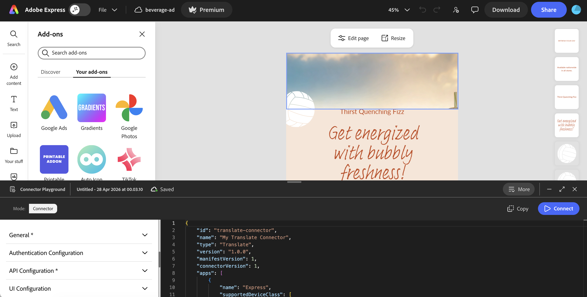

# Getting Started with Adobe Express Translate Connectors

Review prerequisites, download resources, set up the starter project, and verify Playground access before building your connector.

## What you need to build a connector

Building and distributing a connector involves three distinct components:

- **A backend service that conforms to the API spec.** Your service implements the five Translate connector HTTP endpoints (`/health`, `/locales`, `/tones`, `/translate`, `/feedback`) and returns responses that match the schema defined in the [Translate Connector API Reference](../reference/translate-api/index.md). This is the primary thing you need to build. The starter project gives you a working scaffold to start from.
- **Connector Playground to configure your manifest and test locally.** The Playground is a browser-based tool inside Adobe Express. You use it to fill in your connector details through a form builder, generate a `manifest.json`, and connect to your running service for end-to-end testing.
- **A distribution path to deliver the connector to users.** Once your connector is tested, you submit it from **Your integrations** in Adobe Express. Three paths are supported: an [internal listing](submission/internal-listing.md) for users in your enterprise organization, a [public listing](submission/public-listing.md) reviewed by Adobe and enabled for the users and organizations you designate, or a [private share link](submission/private-link.md) for targeted testers. See [Submit your Connector](submission/index.md) to compare the options and pick the right one. Internal listings require an enterprise Adobe account; personal Adobe accounts can't publish internal listings.

## Prerequisites

Before you continue, confirm you have the following:

- **Account access to build and submit connectors.** Enterprise Adobe accounts with a Developer or Administrator role get automatic access to the Connector Playground and connector submission for private link sharing and internal listings. For public listings, submit the [Connector interest form](https://airtable.com/appiNBn2w6uT0cpkR/pag3db7joqgtwXSOv/form) so the team can review your use case. Personal Adobe accounts must also request access using the interest form before the Playground becomes available.
- **A Developer or Administrator role** assigned to your Adobe account by your organization's Adobe administrator. This role is required to enable Add-on Development mode in Adobe Express, which gives you access to the Connector Playground. If you do not have this role, request it from your admin before continuing. If you are unsure who your administrator is, see [How do I contact my org administrator?](https://helpx.adobe.com/enterprise/kb/contact-administrator.html).
- **Node.js 18.8.0 or later**, required to run the TypeScript starter project. You can implement your connector in any language, but the starter project requires Node.js.

### Account access at a glance

What your Adobe Express account can access depends on its type, role, and whether it's been approved through the [Connector interest form](https://airtable.com/appiNBn2w6uT0cpkR/pag3db7joqgtwXSOv/form):

| Account type | Connector Playground | Private share link | Internal listing | Public listing |
|---|---|---|---|---|
| Personal, not yet approved | No access | No access | Not available | No access |
| Personal, approved through the interest form | Available | Available | Not available | Available |
| Enterprise, Developer or Administrator role | Always available | Always available | Always available | Requires separate approval through the interest form |

Internal listings are never available to personal accounts, regardless of approval status; they require an enterprise Adobe account. Public listings always require approval through the interest form, even for enterprise accounts that already have automatic access to the Playground and to private and internal submissions.

## Developer Resources

Three downloadable resources are provided to help you build your connector.

| Resource | Description |
|----------|-------------|
| [`translate-connector-api.yaml`](/static/translate-connector-api.yaml) | OpenAPI 3.0 specification defining the complete API contract. Use this to generate server stubs or run automated validation. For a human-readable version with examples, see the [Translate Connector API Reference](../reference/translate-api/index.md). |
| [`translate-connector-sdk.d.ts`](/static/translate-connector-sdk.d.ts) | TypeScript type definitions for all request and response payloads. Drop this into your project for compile-time safety and editor autocompletion without any registry setup. |
| [`translate-connector-standalone.zip`](/static/translate-connector-standalone.zip) | Self-contained Node.js starter project that implements all five Translate connector endpoints as stubs. Unzip, run `npm install && npm run serve`, and start building. The SDK type definitions are bundled inside with no registry access required. |

<InlineAlert slots="heading,text" />

**Resources are language-agnostic**

You can implement a Translate connector in any language or framework. The OpenAPI specification is the authoritative contract. The TypeScript types and starter project are provided for convenience and are not required.

## Choose a hosting path

You can host your Translate connector service yourself, or let Adobe host it for you as serverless actions on Adobe I/O Runtime. Both paths implement the same five HTTP endpoints and work identically with the Connector Playground, the manifest, and the Translate panel.

- **Self-hosted.** Use the `translate-connector-standalone.zip` starter from the table above, on any infrastructure you manage. Continue to [Use the Starter Project](#use-the-starter-project) below.
- **Adobe-hosted.** Use the [App Builder Template](app-builder-template.md), the `translate-connector-compatibility-service` starter that deploys to Adobe I/O Runtime through the Adobe I/O CLI. No self-hosted infrastructure or HTTPS tunnel required.

The prerequisites and Playground access steps on this page apply to both paths. The rest of this page walks through the self-hosted starter. If you're hosting on Adobe I/O Runtime, see [App Builder Template](app-builder-template.md) instead.

## Use the Starter Project

The starter project is the fastest way to get a working connector service running locally before you integrate your own translation logic. Download [`translate-connector-standalone.zip`](translate-connector-standalone.zip) from the table above, then:

1. Unzip and install dependencies:

   ```bash
   npm install
   ```

2. Build and start the server (default port: 8787):

   ```bash
   npm run serve
   ```

3. Verify the service is running:

   ```bash
   curl http://localhost:8787/health
   ```

   Expected response: `{"message":"OK"}`

Open `src/server.ts` to implement your translation logic. The file contains a `MyTranslateConnector` class with all five endpoint methods already stubbed. Locate each `TODO` comment and replace the stub response with a call to your translation service API.

The starter project also includes built-in auth scaffolding. Set the `AUTH_TYPE` environment variable to `none` (default), `api_key`, or `bearer` to test each authentication mode locally before configuring it in the Playground.

The starter project includes CORS support via the `cors` middleware. This is required when testing with the Connector Playground, since Adobe Express makes requests from the browser to your local service. Your `curl` tests will work without it since `curl` is not affected by CORS. If you build your own service in a different language or framework, see [Enable CORS for Playground testing](endpoint-setup.md#enable-cors-for-playground-testing) before connecting.

<InlineAlert slots="heading, text" variant="warning" />

**Expose your local service over HTTPS for Playground testing**

Adobe Express runs over HTTPS and the Connector Playground calls your service directly from the browser. Plain `http://localhost` URLs may work in Chrome and Edge but are not portable, and Safari blocks them outright. Before connecting, expose your local service over HTTPS using a tunneling tool such as [ngrok](https://ngrok.com/) or [Cloudflare Tunnel](https://developers.cloudflare.com/cloudflare-one/networks/connectors/cloudflare-tunnel/), or a local HTTPS reverse proxy with a trusted certificate (for example, [mkcert](https://github.com/FiloSottile/mkcert) paired with Caddy or nginx). Enter the HTTPS URL the tunnel or proxy provides in the API Configuration form. For deployed environments, a publicly trusted TLS certificate is required. See [HTTPS Requirements](endpoint-setup.md#https-requirements) for full details.

## Verify Connector Playground Access

The Connector Playground is the tool you will use to configure your connector, generate the manifest, and test end-to-end once your service is running.

If you have a Developer or Administrator role on an enterprise Adobe account, or your personal account has been approved through the [Connector interest form](https://airtable.com/appiNBn2w6uT0cpkR/pag3db7joqgtwXSOv/form), open the Playground directly:

**[Open Connector Playground](https://www.adobe.com/go/connector-playground)**

This URL opens Adobe Express and launches the Connector Playground automatically. On first launch, review and accept the Adobe Express Connector Developer Terms of Use (DTOU) to continue.



<InlineAlert slots="heading, text" variant="info" />

**Connector Playground not visible?**

The toggle is only available to enterprise Adobe accounts with a Developer or Administrator role, or personal accounts approved through the [Connector interest form](https://airtable.com/appiNBn2w6uT0cpkR/pag3db7joqgtwXSOv/form). If you believe your account should have access and the toggle is still missing, contact [express-connectors-support@adobe.com](mailto:express-connectors-support@adobe.com).

If the Go URL does not open the Playground automatically, you can navigate to it manually:

<Details slots="heading, list" repeat="1" summary="Find the Connector Playground manually" />

- Steps:
  1. Sign in to [Adobe Express](https://www.adobe.com/express/) with your enterprise Adobe account, or the personal account approved through the Connector interest form.
  2. Click the **Add-ons** icon in the left rail to open the Add-ons panel.
  3. Select the **Your add-ons** tab and scroll to the bottom of the panel until you see the **Add-on Development** section.
  4. Enable the **Connector Playground** toggle.
  5. **First time only:** A Developer Terms of Use dialog appears. Review and accept the Adobe Express Connector Developer Terms of Use (DTOU) to continue.

See [Connector Playground](connector-playground.md) for a full walkthrough of the Playground interface.

## Next Steps

With your resources downloaded and Playground access verified, follow this order:

1. **Implement your service endpoints.** Build the five HTTP endpoints defined in the API specification and choose your authentication method. See [Endpoint Setup](endpoint-setup.md) for authentication options, TypeScript response shape examples, and pre-Playground testing with `curl`.
2. **Configure your connector in the Playground.** Once your service is running, use the form builder in the Connector Playground to configure your connector and generate the manifest. See [Connector Playground](connector-playground.md) for a full walkthrough.
3. **Verify the end-to-end flow.** Confirm each endpoint matches the API contract, the connector loads and connects in the Playground, and the Translate panel behaves as expected. See [Test Your Service](test-your-service.md) for the recommended testing order, `curl` checks, and error-handling verification.
