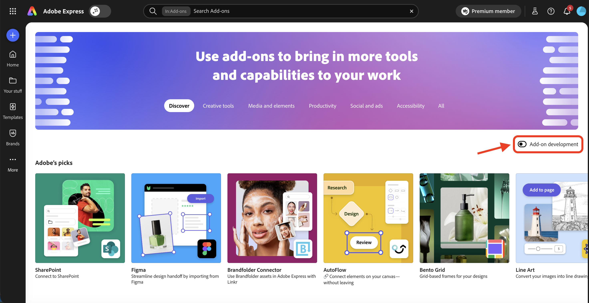
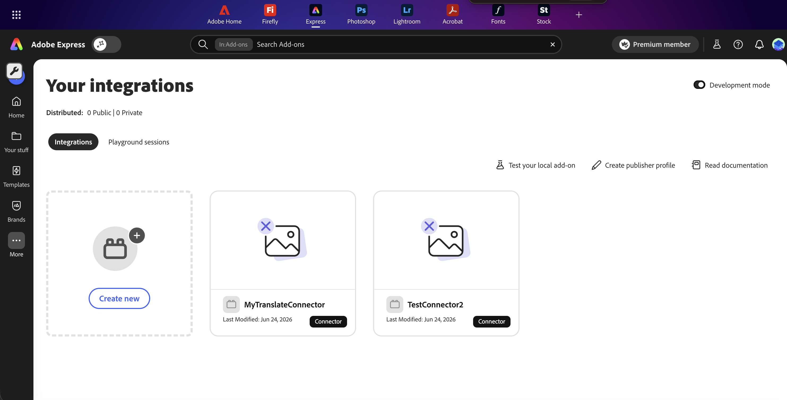
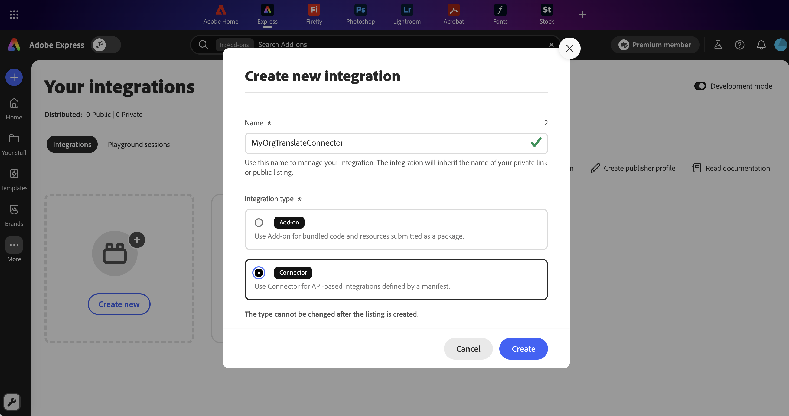
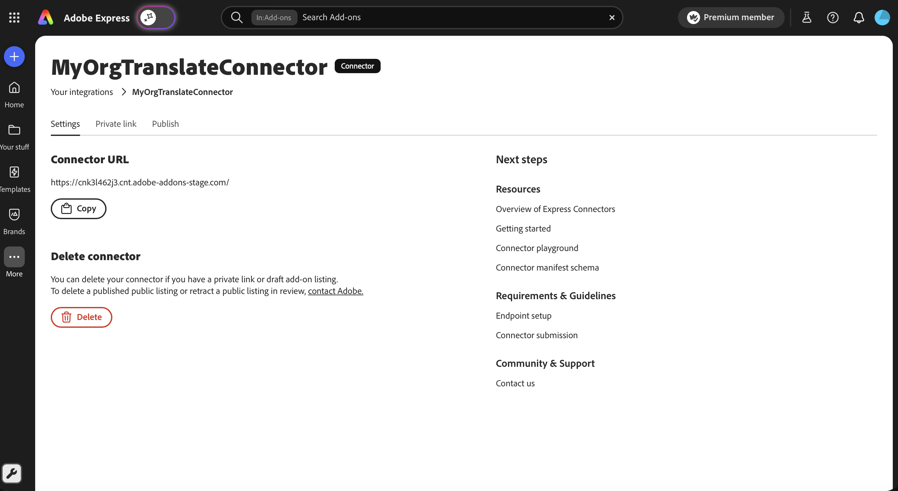
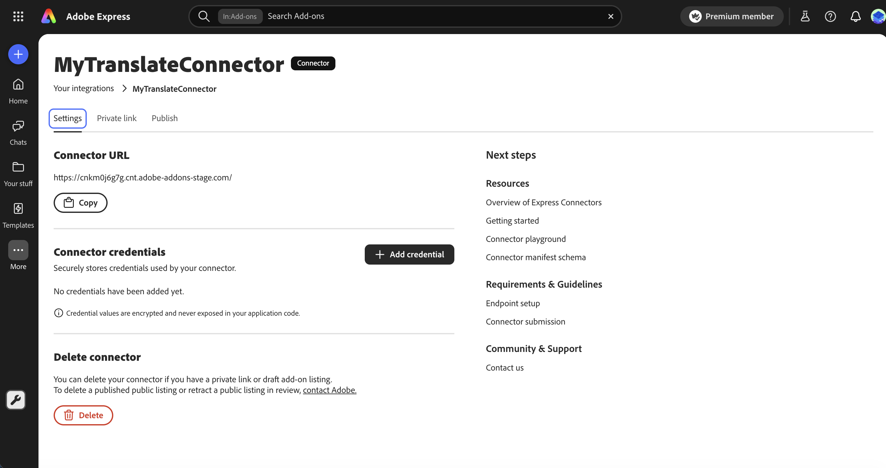
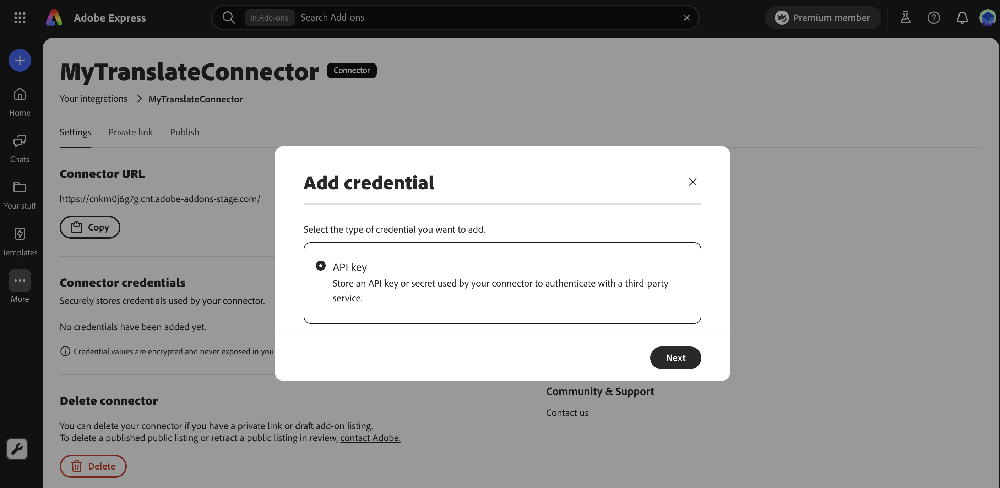
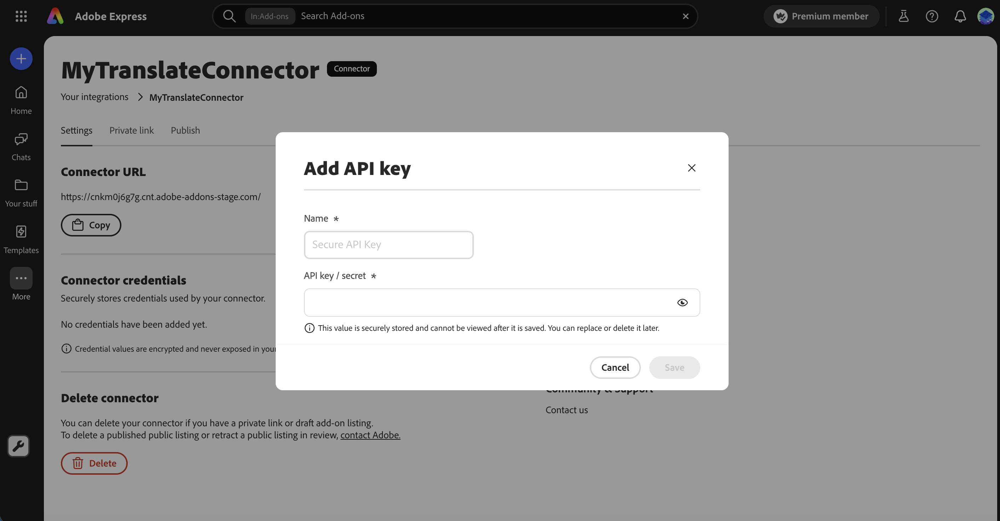
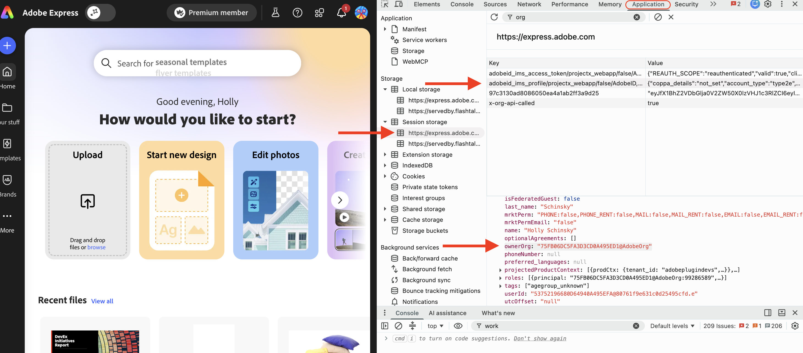

# Submit your Connector

When your connector is tested and ready, you have three ways to distribute it through Adobe Express. This page helps you pick the right path, walks through the shared steps to access Your integrations, and gives you a single lookup for every submission form field. Each path also has its own step-by-step guide.

## Choose your listing type

| Option | Use it when | Visibility |
|---|---|---|
| [Private share link](private-link.md) | You need to share with specific testers or stakeholders before, or instead of, publishing the connector. | Anyone with the link, subject to the connector's authentication requirements and the enterprise account requirement below. |
| [Internal listing](internal-listing.md) | You build for your own enterprise users and want centralized discovery without publishing the connector. | Users in your enterprise organization, via the Translate service dropdown. |
| [Public listing](public-listing.md) | You want broad distribution after Adobe review. | Adobe Express users in enterprises where the connector is enabled after review, via the Translate service dropdown. |

You can publish more than one path for the same connector over time. For example, share a private link with testers first, then promote the connector to a public listing.

<InlineAlert slots="heading, text" variant="info" />

Account and access requirements

Regardless of distribution path, Translate connectors are currently supported only for Adobe Express users signed in with an enterprise account. A private share link, internal listing, or public listing controls how users find or gain access to a connector; it does not change this requirement, and personal account users can't use a connector even with a valid private link. On the publisher side, enterprise Adobe accounts with a Developer or Administrator role get automatic access to submit a connector as a private link or internal listing, while personal Adobe accounts must first request access using the [Connector interest form](https://airtable.com/appiNBn2w6uT0cpkR/pag3db7joqgtwXSOv/form). Public listings require separate approval for both personal and enterprise users; submit the [same interest form](https://airtable.com/appiNBn2w6uT0cpkR/pag3db7joqgtwXSOv/form) so the team can review your use case. If **Connector** does not appear as an integration type in the **Create new integration** dialog, your account does not yet have access. See [Account access at a glance](../getting-started.md#account-access-at-a-glance) for a full breakdown by account type.

## Before you submit

Confirm these basics before you start a submission:

1. **Sign in with the right account.** Your account type and role determine which paths are available:
   - **Personal Adobe account:** Must first request access using the [Connector interest form](https://airtable.com/appiNBn2w6uT0cpkR/pag3db7joqgtwXSOv/form). Once approved, you can create private share links and public listings. Internal listings are not available.
   - **Enterprise Adobe account with Administrator or Developer role:** Automatic access to private share links and internal listings. Public listings require separate approval. Submit the [Connector interest form](https://airtable.com/appiNBn2w6uT0cpkR/pag3db7joqgtwXSOv/form) for the team to review your use case.
   - **Enterprise Adobe account without Administrator or Developer role:** Blocked from all submission paths before reaching the submission UI. Contact your organization's Adobe administrator to request the role. If you're not sure who that is, see [How do I contact my org administrator?](https://helpx.adobe.com/enterprise/kb/contact-administrator.html)
2. **Test your connector.** Validate it in [Connector Playground](../connector-playground.md) and check the manifest against the [connector manifest schema](../../reference/manifest-schema/index.md).
3. **Decide on distribution.** Use the table above to choose between a private share link, an internal listing, or a public listing.
4. **Prepare your assets.** Every path needs a 144x144 px icon, a connector manifest JSON file, and a connector name. Internal and public listings also need full listing copy (summary, description, help URL), 1 to 5 screenshots at 1360x800 px, a publisher profile, and trader details. Public listings additionally need monetization details, and an AI usage disclosure if your connector uses generative AI. See the [Listing field reference](#listing-field-reference) for every field.
5. **Add your Secure API Key credential, if applicable.** If your connector uses Secure API Key authentication, add your key as a credential from your connector's **Settings** tab. This is required before any listing type (private link, internal, or public) will actually work, not just before public review. See [Register your Secure API Key with Adobe](#register-your-secure-api-key-with-adobe).

## Access your integrations

All three paths start from the same place in Adobe Express. Complete these steps once, then continue to the guide for your chosen path.

### Step 1: Open the Add-ons panel

1. Sign in to [Adobe Express](https://express.adobe.com) with the account you plan to publish from. See [Before you submit](#before-you-submit) for account type and role requirements for each submission path.
2. Select **Add-ons** in the left navigation, or open [https://express.adobe.com/add-ons](https://express.adobe.com/add-ons) directly.

### Step 2: Enable Add-on development

Turn on the **Add-on development** toggle in the top-right corner, just below the banner.

Adobe Express switches to the **Your integrations** view, where you manage your add-on and connector integrations and the Connector option becomes available in the new integration dialog.

### Step 3: Create or select your integration

To create a new connector integration:

1. From **Your integrations**, click **Create new**.
2. In the **Create new integration** dialog, enter a **Name** (25 characters or less). Tab out of the field to validate uniqueness. A green checkmark confirms the name is available.
3. Under **Integration type**, select **Connector**.
4. Click **Create**.

If your connector integration already exists, select it from the list of integrations instead.

### Step 4: Note your Connector URL

Open the **Settings** tab to view your connector's unique subdomain URL, and click **Copy** to copy it to your clipboard. You'll need to add it to the allow-list of any service providers your connector communicates with.

The first segment of this URL, before the first dot, is your connector's **Connector ID** (for example, `cnk3l462j3` in `https://cnk3l462j3.cnt.adobe-addons.com`). Adobe Express generates it automatically as soon as you create the integration, and it stays the same across any private share link, internal listing, or public listing you later create for it. If your connector uses Secure API Key authentication, you'll need this Connector ID to [register your key with Adobe](#register-your-secure-api-key-with-adobe): just paste the full URL you copied here, since you don't need to pull out the ID yourself. Adobe derives it from the URL you share.

**Note:** This Connector ID generated as part of the URL is different from the `id` field in your connector manifest.

## What happens after you publish

What happens next depends on the path you chose:

- **Private share link:** The share link is generated and copied to your clipboard right away. Anyone who has the link can install the connector in Adobe Express. Later, you can copy the link again, upload a new manifest to ship updates to everyone who has it, promote the connector to a public listing, or delete the link to revoke access.
- **Internal listing:** The connector publishes to your Adobe enterprise organization without Adobe review. It appears as an option in the Translate service dropdown for users signed in to your organization. Later, you can ship updates by uploading a new manifest under the listing.
- **Public listing:** Public listing distribution remains gated for every account, enterprise or personal. If it isn't enabled for your organization yet, the submission flow shows: "Public listing is not currently enabled for your organization. Contact us to request access." Request access using the [Connector interest form](https://airtable.com/appiNBn2w6uT0cpkR/pag3db7joqgtwXSOv/form). Once enabled, Adobe reviews the submission, which typically takes 5 to 10 days, and emails you when the review is complete. Approval does not automatically make the connector available. Adobe enables it only for the organizations you designate by contacting Adobe after approval. See [After Adobe approves your listing](public-listing.md#after-adobe-approves-your-listing) for the required steps. Later, you can update the listing or release new versions by reopening it in [Your integrations](#access-your-integrations). Updates go through Adobe review again.

## Register your Secure API Key with Adobe

If your connector uses Secure API Key authentication (`authConfig.type: "SECURE_API_KEY"`), configuring your manifest and backend isn't enough on its own. Adobe's secure bridge only forwards requests for connectors that have a Secure API Key credential added, so you also need to add your key from your connector's **Settings** tab. This applies no matter which listing type you use: private share link, internal listing, or public listing. A connector has a single Secure API Key credential that applies globally; there's no per-organization registration.

<InlineAlert slots="text" variant="warning" />

A private share link, internal listing, or public listing for a Secure API Key connector won't work for anyone until you've added your credential. If you're preparing a public listing, add it before you click **Submit for review** so the review team can test your connector.

### Add your credential

1. If you don't already have one, create a connector integration: follow [Step 1 through Step 3](#access-your-integrations) to open Your integrations and create it. You don't need a listing or submission to do this.
2. Build and test your connector using **API Key** in the [Connector Playground](../connector-playground.md). The Playground can only validate connectivity end to end with API Key in this release; Secure API Key is available in the dropdown for manifest generation only.
3. Once testing is complete, switch **Authentication Type** to **Secure API Key** in the Playground and download the manifest. See [Connector Playground: Secure API Key](../connector-playground.md#secure-api-key) for the exact steps.
4. Open the **Settings** tab for your connector integration and find the **Connector credentials** section.
5. Click **Add credential**, select **API key**, and click **Next**.
6. Enter your key or secret in the **API key / secret** field and click **Save**. The value is encrypted and never exposed in your application code; you won't be able to view it again after saving, but you can replace or delete it later.

Adobe Express routes Secure API Key requests through the bridge with your credential injected as soon as you save it, no confirmation email required. To update or remove the key later, return to **Connector credentials** and use the edit or delete action.

### Find an organization ID

An administrator for the enterprise can find the organization ID (also called the IMS Org ID) in the [Adobe Admin Console](https://adminconsole.adobe.com/). Alternatively, any Adobe Express user signed in to that enterprise can find the IMS Org ID in browser DevTools: open the **Application** tab, select **Session storage > https://express.adobe.com/**, choose the key prefixed `adobeid_ims_profile/`, and look for the `ownerOrg` value.

Either the organization name or the organization ID works when you share this information with Adobe or with reviewers. Adobe can resolve one from the other.

## Listing field reference

Use this section as a lookup while you complete the submission form for your chosen path. The **Applies to** column shows which paths collect each field. A private share link collects only the Connector icon, Connector name, Connector manifest, and Release notes fields. Internal and public listings collect most of the fields below; a few, such as Support email address, End User License Agreement (EULA), AI usage details, and monetization details, are public-only. Check the **Applies to** column for each field.

### Listing details

| Field | Applies to | Required | Max | Description |
|---|---|---|---|---|
| **Connector name** | Private, Internal, Public | Yes | 25 chars | Unique name shown to users. At least 3 characters, no special characters. Overrides the project name; a public listing name can later override a private link name. |
| **Connector icon** | Private, Internal, Public | Yes | 144x144 px | JPEG or PNG. Adobe Express auto-resizes the icon for the different surfaces where it appears. |
| **Summary** | Internal, Public | Yes | 50 chars | One-line description of what your connector does. |
| **Full description** | Internal, Public | Yes | 1000 chars | Full context, features, and value of your connector. |
| **Help URL** | Internal, Public | Yes | 1000 chars | Link to user-facing help or documentation. |
| **Privacy notice** | Internal, Public | Recommended | 1000 chars | Link to your privacy notice. |
| **Keywords** | Internal, Public | Recommended | 100 chars | Comma-separated terms that help users find your connector. |
| **Screenshots** | Internal, Public | Yes | 1 to 5 images | 1360x800 px JPEG or PNG. Re-orderable after upload. |
| **Support email address** | Public | Yes | 1000 chars | Email users contact for support. |
| **End User License Agreement (EULA)** | Public | Recommended | 1000 chars | Link to your EULA. |

### Version details

| Field | Applies to | Required | Max | Description |
|---|---|---|---|---|
| **Connector manifest** | Private, Internal, Public | Yes |  | The connector manifest as a `.json` file. Must be valid JSON and conform to the [connector manifest schema](../../reference/manifest-schema/index.md). |
| **Languages supported** | Internal, Public | Yes |  | Languages your connector's UI supports. This is the UI language list, not the languages the translate service offers. English (US) is included by default and cannot be removed. |
| **Release notes** | Private, Internal, Public | Recommended | 1000 chars | Information specific to this version of the connector. |

### Publisher profile

Applies to internal and public listings, first submission only. After submission, the profile is locked. To update it later, contact the Adobe Express Translate Connectors team.

| Field | Required | Max | Description |
|---|---|---|---|
| **Publisher logo** | Recommended | 250x250 px | JPEG or PNG. Represents you or your company. |
| **Publisher name** | Yes | 45 chars | Your name or company name. Must be unique. |
| **Publisher website** | Recommended | 1000 chars | Link to your company or product website. |
| **Description** | Recommended | 500 chars | Short description of you or your company. |

### Trader details

Applies to internal and public listings, for EU compliance. In accordance with the [European Union Digital Services Act](https://eur-lex.europa.eu/legal-content/EN/ALL/?uri=CELEX:32022R2065), you must provide Trader details for your listing to be visible to Adobe Express users in the EU. Selecting **No** keeps the listing hidden from EU users. Trader details are locked after submission; contact Adobe to update them later.

| Field | Required when EU = Yes | Max | Description |
|---|---|---|---|
| **Business email address** | Yes | 60 chars | Public business contact email. |
| **Country code** | Yes |  | Telephone country code (paired with the business telephone number). |
| **Business telephone number** | Yes | 20 chars | Public business contact number. |
| **Business street address or P.O. Box** | Yes | 100 chars | Public business address. |
| **Address line 2** | Optional | 100 chars | Additional address detail. |
| **City** | Yes | 40 chars | City of the business address. |
| **State** | Yes | 100 chars | State or region of the business address. |
| **Postal/Zip code** | Yes | 20 chars | Postal or ZIP code of the business address. |
| **Country** | Yes |  | Country for the business address. |
| **Business D-U-N-S number** | Optional | 11 chars | Business identification number used by app stores and online marketplaces to verify trader information. A no-cost option to obtain a D-U-N-S number is available to any business. |

### AI usage details

Applies to public listings. Answer **Yes** to the entry question if your connector uses generative AI to reveal the rest of the section; answer **No** to skip it. Adobe rejects connectors that generate illegal or policy-violating content.

| Field | Required | Max | Description |
|---|---|---|---|
| **Does your connector use AI to generate content?** | Yes | | Entry question. Select **No** to skip the rest of this section. |
| **What technologies, models, and/or platforms does your connector utilize?** | Required when AI = Yes | 1000 chars | Free-text description of the AI technologies your connector relies on. |
| **What content does your connector generate?** | Required when AI = Yes | | One or more of Text, Images, Video, Speech, Music, Other Audio, Code. |
| **Does your connector filter or apply any post-processing to ensure that restricted content is removed or hidden?** | Required when AI = Yes | | Select **Yes** or **No**. |
| **What types of input does your connector accept from users?** | Required when AI = Yes | | One or more of Text, Imagery, Audio, Curated Input, Music, No input. These are the inputs supplied to the generative AI model. |
| **Can a user disable any safety or content-filtering mechanisms?** | Required when AI = Yes | | Select **Yes** or **No**. |
| **Do you test your connector's output to ensure it is not generating restricted content?** | Required when AI = Yes | | Select **Yes** or **No**. |
| **Describe how you test your connector for restricted content.** | Required when AI = Yes | 1000 chars | Include how you test, how often, and how you protect against inappropriate content and copyright/IP infringement. |
| **Provide a URL to any documentation you wish users to see about how you approach AI from an ethical perspective.** | Optional | 1000 chars | Appears under **AI usage information provided to users**. Adobe Express shows this link to users in the connector listing. |
| **Provide a URL to any documentation you wish users to see about how your connector uses AI to accomplish its task.** | Optional | 1000 chars | Appears under **AI usage information provided to users**. Adobe Express shows this link to users in the connector listing. |

### Monetization details

Applies to public listings. Review the [connector monetization guidelines](monetization-guidelines.md) before completing this section.

| Field | Required | Description |
|---|---|---|
| **Monetization model** | Yes | One of Free, Free and paid plans available, Free trial, Paid. |
| **Payment options** | Yes (when not Free) | One or more of One-time payment, Recurring subscription, Micro-transactions. |
| **Additional details** | Optional (250 chars) | Plain-text description of payment terms, for example "7-day free trial" or "$9.99/month". |

### Asset quick reference

| Asset | Applies to | Format | Dimensions |
|---|---|---|---|
| **Connector icon** | Private, Internal, Public | JPEG or PNG | 144x144 px |
| **Screenshots** | Internal, Public | JPEG or PNG | 1360x800 px (1 to 5 images) |
| **Publisher logo** | Internal, Public | JPEG or PNG | 250x250 px |
| **Connector manifest** | Private, Internal, Public | JSON | n/a |

## Troubleshoot common issues

Use this section as a lookup for submission errors across all three paths. The **Applies to** column shows which paths can hit each issue.

| Symptom | Applies to | Cause | Resolution |
|---|---|---|---|
| **Connector** doesn't appear as an integration type in the **Create new integration** dialog, or a distribution card is missing from the **Publish** tab | Private, Internal, Public | Personal account not yet approved through the Connector interest form, or enterprise account missing the Developer/Administrator role. | Request access using the [Connector interest form](https://airtable.com/appiNBn2w6uT0cpkR/pag3db7joqgtwXSOv/form), or contact the Adobe Express Translate Connectors team at [express-connectors-support@adobe.com](mailto:express-connectors-support@adobe.com). |
| **Internal listing** card is not offered (you see only a Create public listing prompt) | Internal | Signed in with a personal Adobe account. Internal listings require an enterprise account. | Sign out and sign back in with your enterprise Adobe account. |
| **Connector name** shows an inline error | Private, Internal, Public | Name is already taken, is shorter than 3 characters, longer than 25 characters, or contains special characters. | Choose a unique name, 3 to 25 characters, with no special characters. |
| **Publish** or **Submit for review** button stays disabled | Internal, Public | Required fields are missing or invalid. | Open the **Jump to** dropdown. Incomplete sections aren't marked with a checkmark. |
| Manifest upload fails with a schema error | Private, Internal, Public | Manifest doesn't conform to the connector manifest schema. | Review the [connector manifest schema](../../reference/manifest-schema/index.md) and re-upload. |
| Manifest upload fails with a file-type error | Private, Internal, Public | Uploaded a `.zip` instead of a `.json` file. Add-ons upload a `.zip`; connectors upload the manifest `.json` directly. | Re-upload the connector manifest as a single `.json` file. |
| Endpoint check fails | Internal, Public | Adobe's test payload can't reach your connector's endpoint. | Confirm your service is reachable and the connector URL is on the service-provider allow-list. |
| Listing isn't visible to users in the EU | Internal, Public | Trader details are set to **No**, or weren't provided. | Contact the Adobe Express Translate Connectors team at [express-connectors-support@adobe.com](mailto:express-connectors-support@adobe.com) to update your publisher profile with Trader details. |
| Testers report they can't install through a private link | Private | The link was deleted or replaced. | Open the listing's **Private link** tab, delete and recreate the private link, then resend the new URL. |
| Reviewer can't sign in or gets auth errors testing your connector | Public | Secure API Key credential hasn't been added yet, or the reviewer's test organization hasn't been granted visibility for the listing. | Complete [Register your Secure API Key with Adobe](#register-your-secure-api-key-with-adobe) before resubmitting, and confirm the reviewer's test organization has visibility (see [Enable your connector for specific enterprises](public-listing.md#enable-your-connector-for-specific-enterprises)). |
| Review reports a monetization mismatch | Public | Pricing in your listing doesn't match what users see in checkout. | Update either the listing or the checkout to match, then resubmit. |
| Connector isn't appearing in the Translate dropdown after approval | Public | Enablement is still being processed. | Allow a few business days after approval. If it still hasn't appeared, contact the Adobe Express Translate Connectors team at [express-connectors-support@adobe.com](mailto:express-connectors-support@adobe.com). |

## Related documentation

- [Private share link guide](private-link.md)
- [Internal listing guide](internal-listing.md)
- [Public listing guide](public-listing.md)
- [Connector monetization guidelines](monetization-guidelines.md)
- [Connector Playground](../connector-playground.md)
- [Connector manifest schema](../../reference/manifest-schema/index.md)
- [Getting Started](../getting-started.md)
- [Changelog](../../reference/changelog/index.md)
- [FAQ](../../support/faqs/index.md)
- [Troubleshooting](../../support/troubleshooting/index.md)
