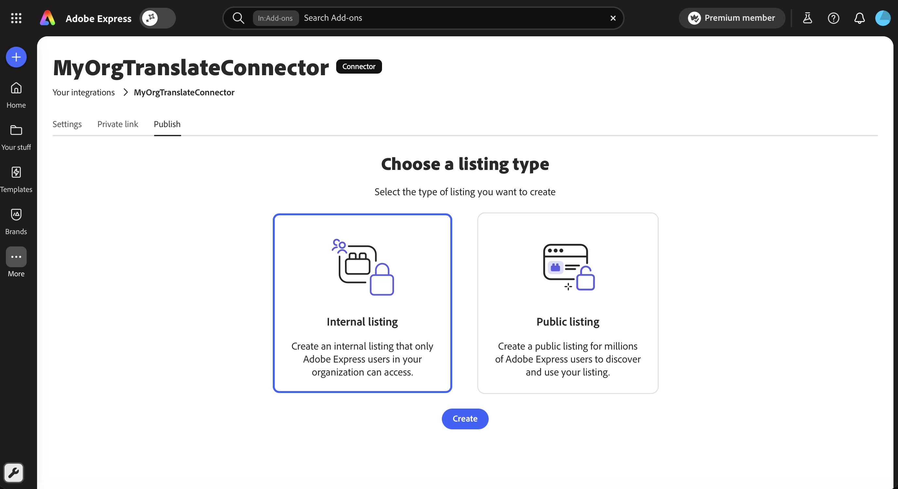
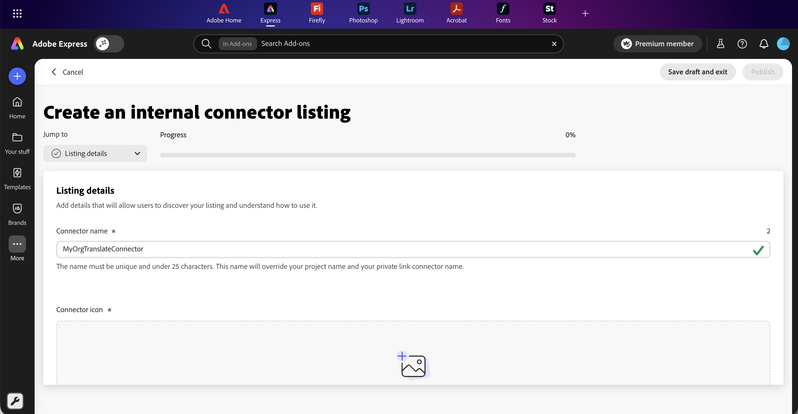
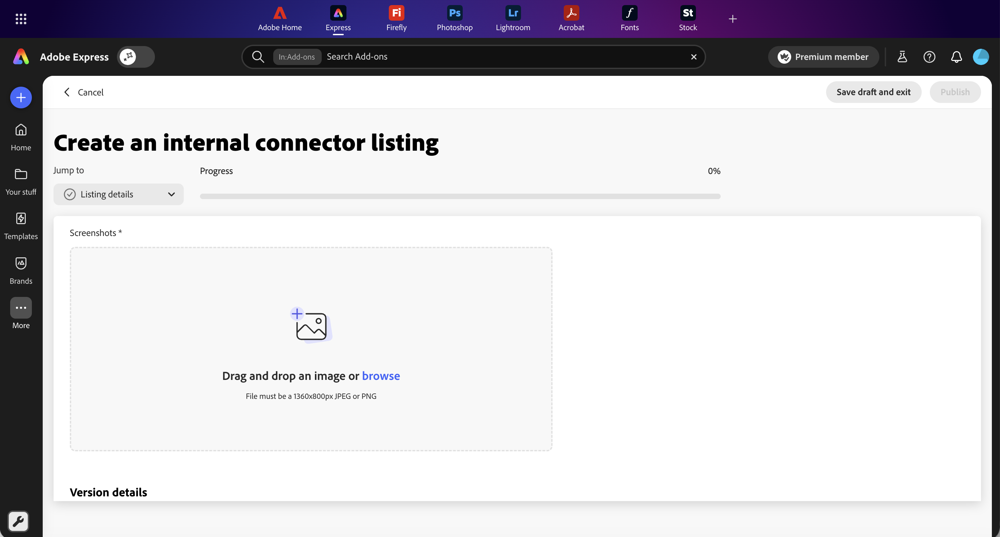
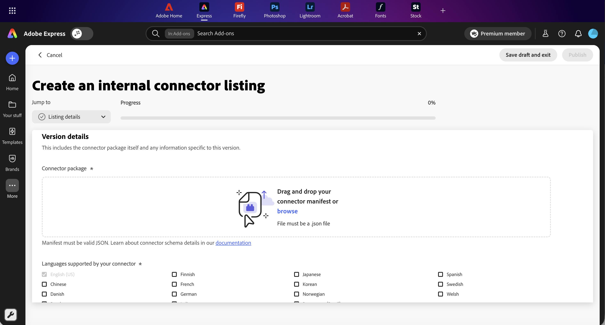
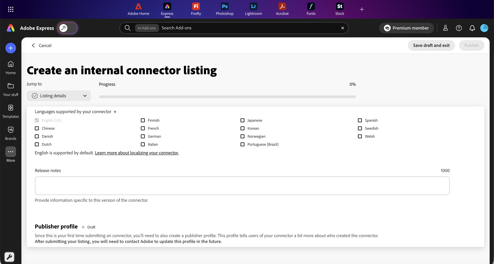
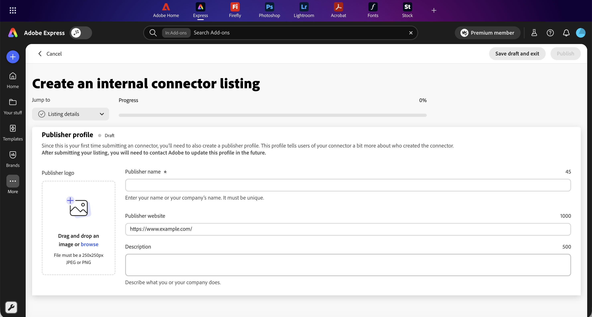
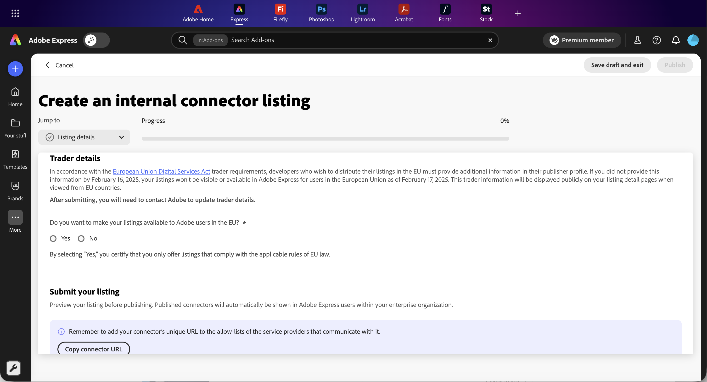
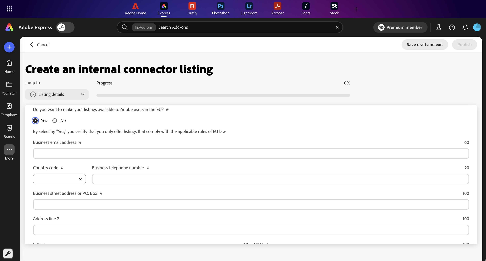
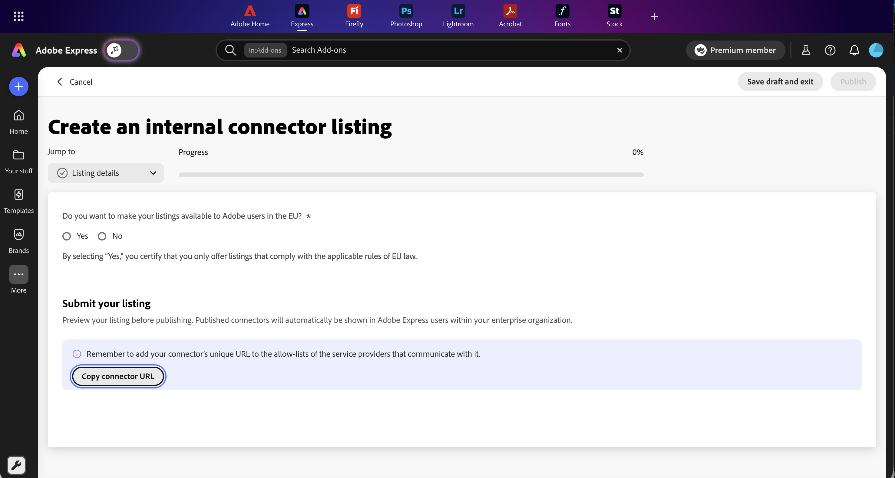

# Publish a Connector as an internal listing

An internal listing publishes your connector to users in your Adobe enterprise organization. The connector appears as an option in the Translate service dropdown inside Adobe Express for users signed in to the same enterprise organization as the publisher. Use an internal listing when you want enterprise-only distribution without exposing the connector publicly. For other distribution paths, see [Submit your Connector](index.md).

## Internal listing requirements

See [Before you submit](index.md#before-you-submit) for the account, role, and testing requirements that apply to every submission path. Internal listings add the following:

- **Enterprise account required:** Personal Adobe accounts don't belong to an organization, so the **Internal listing** card isn't offered when you sign in with one. Confirm you're signed in with the account whose organization should receive the connector. The publishing organization is locked to the account that publishes the listing.
- **Where it publishes:** Internal listings appear as an option in the Translate service dropdown inside Adobe Express for users signed in to the same enterprise organization as the publisher.
- **What's validated:** Adobe does not review the connector itself for internal listings. Adobe validates your publisher profile, your manifest's schema and unique identifiers, and runs an operational check against your connector's endpoint.
- **Prepare your assets and metadata:** Internal listings collect the full [Listing field reference](index.md#listing-field-reference) except the Support email address, End User License Agreement (EULA), AI usage details, and monetization details. Gather your icon, manifest, screenshots, listing copy, and publisher and trader details before you open the submission form.
- **Secure API Key credential:** If your connector uses Secure API Key authentication, add your key as a credential from your connector's **Settings** tab. It's required regardless of listing type. See [Register your Secure API Key with Adobe](index.md#register-your-secure-api-key-with-adobe).

<InlineAlert slots="heading, text" variant="warning" />

**This listing won't work until registration completes**

An internal listing isn't reviewed by Adobe, but a Secure API Key connector still won't work for your organization's users until you've added your credential.

## Submission steps

<InlineAlert slots="heading, text" variant="info" />

What to expect

Expect about 15 minutes for the end-to-end flow once your metadata and assets are ready. You can **Save draft and exit** at any point and return later.

### Access Your integrations first

Follow [Access your integrations](index.md#access-your-integrations) to open the Add-ons panel, enable Add-on development, create or select your connector integration in the Your integrations view, and note your Connector URL. Sign in with your enterprise Adobe account so the **Internal listing** card appears. Then return here for the internal-listing steps below.

### Step 1: Choose Internal listing

1. Open the **Publish** tab.
2. Select the **Internal listing** card.
3. Click **Create**.

<InlineAlert slots="heading, text" variant="warning" />

Internal listing not available?

Internal listings publish to users in an enterprise organization, so the **Internal listing** card only appears for enterprise Adobe accounts. Personal accounts see the third tab labeled **Public listing** with only a Create public listing prompt. Sign out and sign back in with the enterprise Adobe account whose organization should receive the connector.

### Step 2: Complete Listing details

The **Create an internal connector listing** form opens. Use the **Jump to** dropdown to navigate between sections; the progress bar fills as you complete required fields.

Fill in the **Listing details** fields, including 1 to 5 screenshots. See [Listing details](index.md#listing-details) for field requirements.

For screenshots, the first one appears as the hero image on the connector's listing detail page, so put your strongest screen first.

### Step 3: Complete Version details

Upload your connector manifest as a `.json` file, select every language your connector's UI supports, and add **Release notes** for this version. **English (US)** is included by default and cannot be removed. See [Version details](index.md#version-details) for field requirements.

If your connector uses Secure API Key authentication, you still need to add your credential from the connector's **Settings** tab. This is required regardless of listing type. See [Register your Secure API Key with Adobe](index.md#register-your-secure-api-key-with-adobe).

### Step 4: Confirm your Publisher profile and Trader details

If this is your first submission, complete your **Publisher profile**. Adobe validates this profile before publishing the connector. See the [Publisher profile](index.md#publisher-profile) field reference for every field.

Then decide whether to make your listing available to Adobe Express users in the European Union under **Trader details**. See the [Trader details](index.md#trader-details) field reference for every field.

- Select **Yes** to provide your business contact information. Adobe displays this information on your listing detail page when viewed from EU countries.
- Select **No** to keep the listing hidden from EU users. You can update this later by contacting Adobe.

<InlineAlert slots="text" variant="info" />

Both sections are locked after submission. To update them later, contact the Adobe Express Translate Connectors team.

### Step 5: Submit your listing

1. Review your entries. The **Jump to** dropdown shows checkmarks beside complete sections and the progress bar should read **100%**.
2. In the **Submit your listing** section, click **Copy connector URL** and confirm the URL is on the allow-list of any service providers your connector communicates with (see [Step 4: Note your Connector URL](index.md#step-4-note-your-connector-url)).
3. Click **Publish**, or **Save draft and exit** to finish later.

The **Publish** button is enabled only when all required fields are valid and the progress bar reaches 100%.

## What Adobe validates at submit

The platform runs the following checks before your connector is published:

| Check | What it verifies |
|---|---|
| Manifest JSON | File parses as valid JSON. |
| Manifest schema | Manifest conforms to the connector manifest schema. |
| Manifest identifiers | Unique connector ID and a present version number. |
| Endpoint connectivity | Adobe sends a test payload to your connector's endpoint to confirm it's operational. |
| Publisher profile | Adobe reviews the publisher profile for completeness and accuracy. |

If a check fails, the form displays an inline error describing what to fix. Drafts you saved earlier remain intact while you correct and resubmit.

## After you publish

- Your connector becomes available as an option in the Translate service dropdown inside Adobe Express for users signed in to the same enterprise organization as the publisher.
- Your publisher profile and trader details are locked. To update them, contact the Adobe Express Translate Connectors team at [express-connectors-support@adobe.com](mailto:express-connectors-support@adobe.com).
- To ship a new version of the connector, open the listing under [Your integrations](index.md#access-your-integrations), upload the new `manifest.json` file, and update the release notes.

## Troubleshoot common issues

For internal-listing issues (card not offered, name conflicts, manifest and endpoint checks, EU visibility), see the consolidated [Troubleshoot common issues](index.md#troubleshoot-common-issues) table, which flags which issues apply to internal listings.

## Related documentation

- [Submit your Connector](index.md)
- [Public listing guide](public-listing.md)
- [Private share link guide](private-link.md)
- [Connector Playground](../connector-playground.md)
- [Connector manifest schema](../../reference/manifest-schema/index.md)
- [Getting Started](../getting-started.md)
- [FAQ](../../support/faqs/index.md)
- [Troubleshooting](../../support/troubleshooting/index.md)
