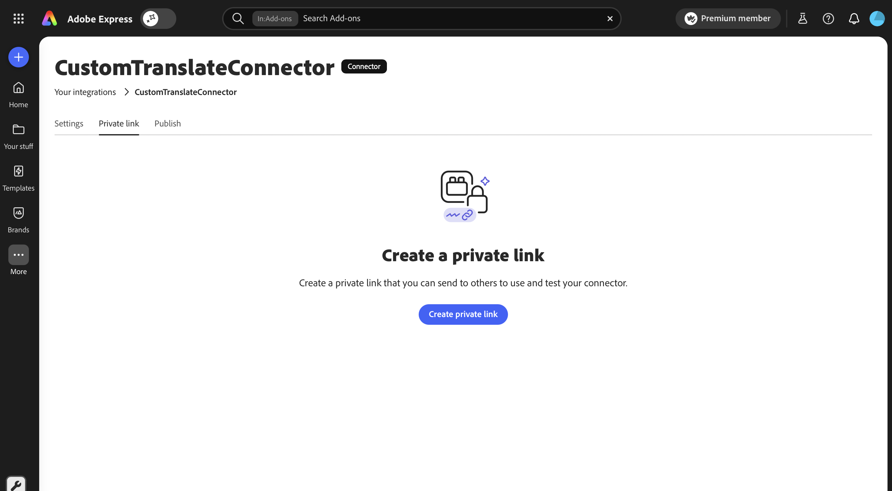
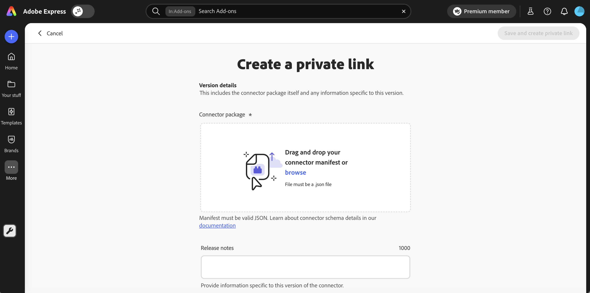
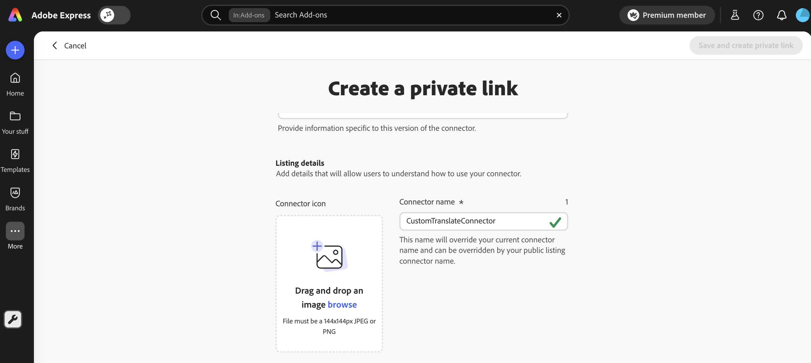
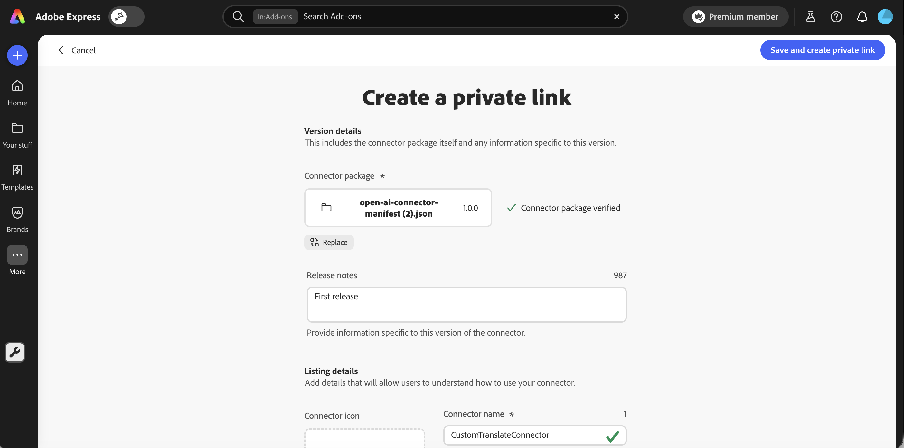
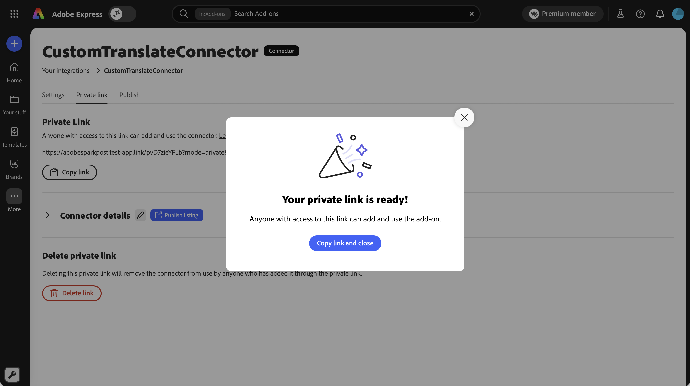
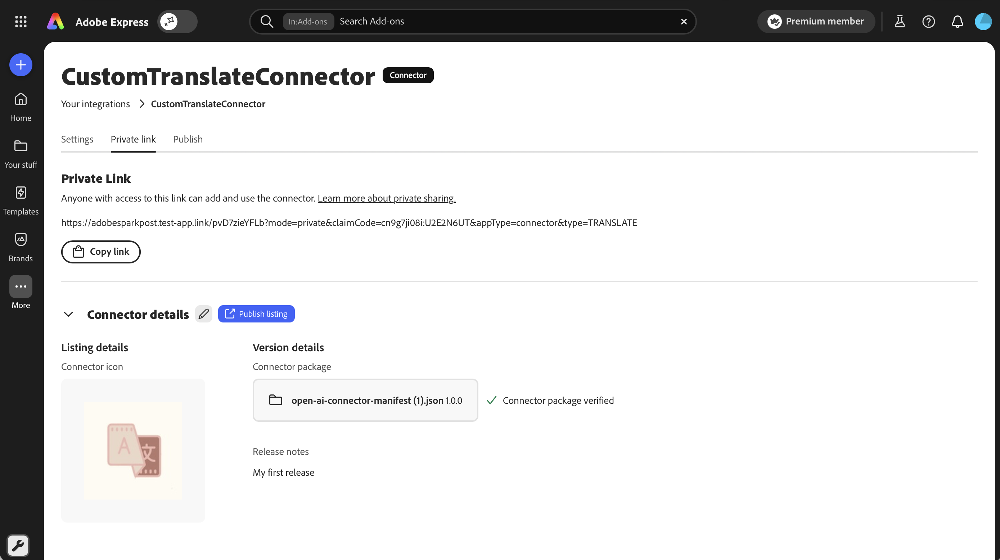
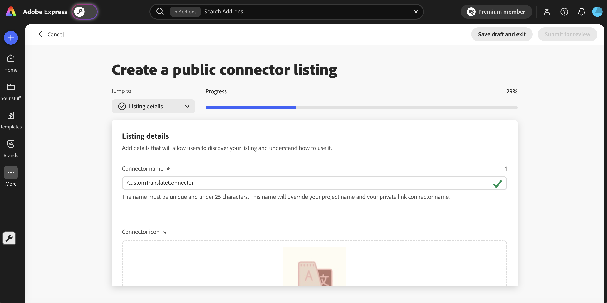

# Create a private share link for a Connector

A private share link is a unique URL you can send to anyone to use or test your connector in Adobe Express. The connector isn't published broadly and Adobe does not review private share links. Use a private share link for beta testing, stakeholder review, or limited rollouts. For other distribution paths, see [Submit your Connector](index.md).

## Before you begin

- **Account required:** Sign in with a personal Adobe account or an enterprise Adobe account with the Administrator or Developer role in the [Adobe Admin Console](https://adminconsole.adobe.com/). Enterprise accounts without this role are blocked from all submission paths before reaching the submission UI.
- **Test first:** Configure and validate your connector in the [Connector Playground](../connector-playground.md) before sharing the link.
- **Treat the link like a credential:** Anyone with the URL can install the connector. Recipients do not need to be enrolled in the connector early-access program. Adobe Express does not require sign-in scoped to your organization for private share link installs.
- **Getting ready for a public listing?** Create a private share link first when you want to test with specific people yourself, or ship updates outside of a listing review cycle, then later you can come back and create a public listing. See [Get your connector ready for review](public-listing.md#get-your-connector-ready-for-review) for what's needed when you're ready to create a public listing.
- **Secure API Key registration:** If your connector uses Secure API Key authentication, register your key with Adobe using the organization(s) it should serve and your connector's Connector ID. You can get your Connector ID as soon as you create your integration (no listing required) from the Settings tab described in [Step 4](index.md#step-4-note-your-connector-url). It's required regardless of which listing type you use. See [Register your Secure API Key with Adobe](index.md#register-your-secure-api-key-with-adobe).

<InlineAlert slots="heading, text" variant="warning" />

**This link won't work until registration completes**

If your connector uses Secure API Key authentication, anyone who opens this private link will hit an authentication error until Adobe confirms your key registration for their organization.

## Submission steps

### Access Your integrations first

Follow [Access your integrations](index.md#access-your-integrations) to open Your integrations, enable Add-on development, and create or select your connector integration. Then return here to create the private link.

### Step 1: Open the Private link tab

Open the **Private link** tab on your connector's listing settings page, then click **Create private link**.

### Step 2: Upload your connector manifest

Drag and drop your connector `manifest.json` file into the dropzone shown below, or click **browse** to choose a file from your computer.

<InlineAlert slots="text" variant="info" />

The connector manifest file must be a single, valid `.json` file. The file is verified on upload.

### Step 3: Add release notes

After your connector `manifest.json` has been verified, you can add **Release notes** (recommended, up to 1000 characters) so testers know what changed in this version.

### Step 4: Complete Listing details

Add an icon and name for the connector as it will appear to users who install through the link. A private share link collects only the connector icon, name, manifest, and release notes. See the [Listing field reference](index.md#listing-field-reference) for full field requirements.

1. Upload a 144x144 px JPEG or PNG icon.
2. Enter a **Connector name** (25 characters or less). The name must be unique and at least 3 characters long with no special characters. This name overrides your current connector project name and can later be overridden by a public listing connector name if you promote the listing.

### Step 5: Create the private link

When all required fields are valid, the **Save and create private link** button enables in the top-right corner.

After saving, a confirmation dialog appears with a **Copy link and close** button.

The **Private link** tab displays your generated link URL. Click **Copy link** to copy the URL to your clipboard. Save it for sharing and future reference. Anyone with the link can install the connector.

## Share, update, and manage the private share link

Open the **Private link** tab on your connector's listing settings page to manage the link.

### Copy the private share link

After your private share link has been created, you can copy it again at any time in this tab using the **Copy link** button.

### Update the connector version

To ship a new version to testers, open the listing's **Private link** tab, click the **Update private link** action, and upload a new manifest. Users with the link automatically get the latest version the next time they invoke the connector.

<InlineAlert slots="text" variant="info" />

Your private share URL is persistent across updates. Uploading a new manifest or editing listing details updates what the link resolves to, but not the link itself. A new URL is generated only if you delete and recreate the private share link.

### Promote a private share link to a public listing

When you're ready to publish your connector publicly, you can promote a private share link into a public listing without recreating the connector.

1. Open the listing's **Private link** tab.
2. Click **Publish listing**.
3. The public listing form opens. Fill in the additional fields the public listing requires (summary, full description, screenshots, AI usage disclosure, monetization details, publisher profile, trader details).
4. Click **Submit for review**.

The public listing form opens prefilled with the icon, name, and manifest from the private share link so you don't have to re-enter everything, but you can review and edit as needed.

For details on each public listing field, see [Publish a Connector as a Public Listing](public-listing.md).

### Delete the private share link

To revoke access for everyone who installed through the link:

1. Open the listing's **Private link** tab.
2. Click **Delete private link**.
3. Confirm in the dialog. Users who installed through the link lose access immediately.

Deleting the private share link does not delete the connector project or any associated public or internal listings.

## After you share the link

- Send the link only to people you trust. Adobe Express does not restrict who can install the connector from the link.
- Testers install the connector by opening the link in Adobe Express. The connector appears in their Adobe Express session like any installed integration.

## Troubleshoot common issues

Private-link-specific issues are listed below. For shared issues (early-access enrollment, manifest schema and file-type errors, name conflicts), see the consolidated [Troubleshoot common issues](index.md#troubleshoot-common-issues) table.

| Symptom | Cause | Resolution |
|---|---|---|
| Testers report they can't install through the link | Link was deleted or replaced | Open the listing's Private link tab, delete and recreate the private link, then resend the new URL. |

## Related documentation

- [Submit your Connector](index.md)
- [Public listing guide](public-listing.md)
- [Internal listing guide](internal-listing.md)
- [Connector Playground](../connector-playground.md)
- [Connector manifest schema](../../reference/manifest-schema/index.md)
- [Getting Started](../getting-started.md)
- [FAQ](../../support/faqs/index.md)
- [Troubleshooting](../../support/troubleshooting/index.md)
