# Publish a Connector as a public listing

A public listing submits your connector for Adobe review. After approval, your connector becomes available as an option in the Translate service dropdown for Adobe Express users in the enterprises where it is enabled. Use a public listing when you want broad distribution beyond your enterprise organization, including as a commercial offering. For other distribution paths, see [Submit your Connector](index.md).

## Before you begin

- **Account required:** Sign in with an enterprise Adobe account with the Administrator or Developer role in the [Adobe Admin Console](https://adminconsole.adobe.com/), or a personal Adobe account approved through the [Connector interest form](https://airtable.com/appiNBn2w6uT0cpkR/pag3db7joqgtwXSOv/form). Enterprise accounts without this role are blocked from all submission paths before reaching the submission UI.
- **Public listing approval:** Public listing distribution remains gated for every account, enterprise or personal, separately from basic submission access. If it isn't enabled for your organization yet, the submission flow shows: "Public listing is not currently enabled for your organization. Contact us to request access." Request access using the same [Connector interest form](https://airtable.com/appiNBn2w6uT0cpkR/pag3db7joqgtwXSOv/form).
- **Test first:** Configure and validate your connector in the [Connector Playground](../connector-playground.md) before submitting.
- **Plan for review:** Adobe reviews the connector, listing copy, screenshots, AI usage disclosure, monetization details, and publisher profile. What else reviewers need depends on your authentication type: Secure API Key connectors need an Adobe organization where your key is registered, plus test credentials to sign in to Express with that organization if needed. OAuth 2.0 PKCE connectors need test credentials for your own service to enter in the OAuth modal; the organization the reviewer signs in with doesn't matter. You'll provide these test details in the **Notes to reviewer** section of the listing. See [Get your connector ready for review](#get-your-connector-ready-for-review) for the steps.
- **Read the monetization guidelines:** Before filling in any payment fields, review the [connector monetization guidelines](monetization-guidelines.md).

## How a public listing differs from an internal listing

A public listing builds on the same submission workflow as an internal listing. The differences are:

- Adobe runs a full review (5 to 10 days) instead of automated validation only.
- AI usage disclosure is required for any connector that uses generative AI.
- Monetization details are required, even for free connectors.
- The Listing details section adds Support email address and End User License Agreement (EULA) fields beyond what an internal listing collects.
- After approval, your connector becomes available to Adobe Express users in the enterprises where it is enabled. Users in those enterprises see it as an option in the Translate service dropdown.

## Get your connector ready for review

Complete these steps before you open the public listing submission form. What you need to gather depends on your connector's authentication type:

- **Secure API Key connectors:** Unlike OAuth, a Secure API Key connector can only be used from Adobe organizations where that key is registered. Identify the Adobe organization(s) your connector should serve, get your Connector ID from the Settings tab of your integration (see [Step 4](index.md#step-4-note-your-connector-url)), and [register your Secure API Key with Adobe](index.md#register-your-secure-api-key-with-adobe) using both. If the review team needs to sign in to Express to test your connector, create test credentials in one of those organizations for them to use.
- **OAuth 2.0 PKCE connectors:** Prepare a set of test credentials for your own service that the review team can enter in the OAuth modal when they connect. The Adobe organization the reviewer signs in with doesn't matter for OAuth connectors.

Keep this information on hand. You'll add it to **Notes to reviewer** in [Step 8: Submit for review](#step-8-submit-for-review).

<InlineAlert slots="heading, text" variant="warning" />

**Submit only after registration completes**

If you submit for review before your Secure API Key registration is confirmed, the review team's test organization won't be able to use your connector, and your review will stall until registration completes.

## Submission steps

<InlineAlert slots="text" variant="info" />

Review [Prepare your submission](#prepare-your-submission) below for the metadata, asset formats, character limits, and validation rules referenced in these steps. Then expect 30 to 60 minutes for the first submission, depending on how much listing copy and how many screenshots you have ready. You can **Save draft and exit** at any point.

### Access Your integrations first

Follow [Access your integrations](index.md#access-your-integrations) to open Your integrations, enable Add-on development, create or select your connector integration, and note your Connector URL. Then return here for the public-listing-specific steps below.

### Step 1: Choose Public listing

1. Open the **Publish** tab.
2. Select the **Public listing** card.
3. Click **Create**.

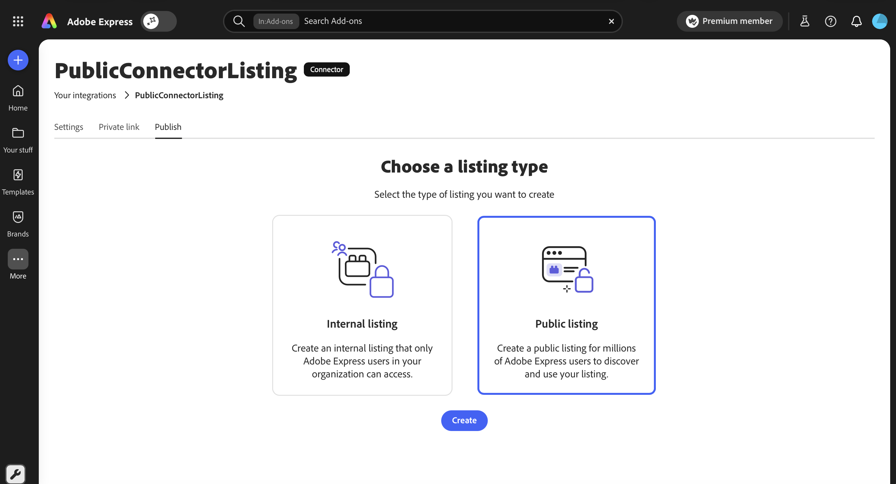

### Step 2: Complete Listing details

The **Create a public connector listing** form opens. Use the **Jump to** dropdown to navigate between sections; the progress bar fills as you complete required fields.

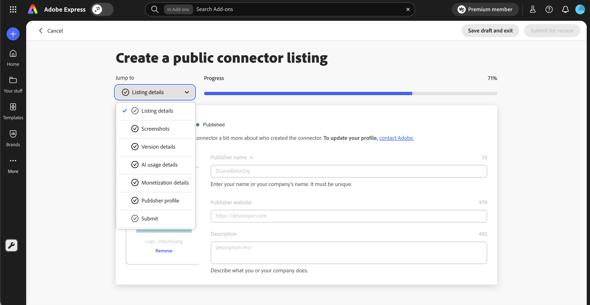

Fill in the **Listing details** fields. Public listings collect the same Listing details fields as an internal listing plus Support email address and End User License Agreement (EULA). See the [Listing details](index.md#listing-details) field reference for every field, including the public-only additions.

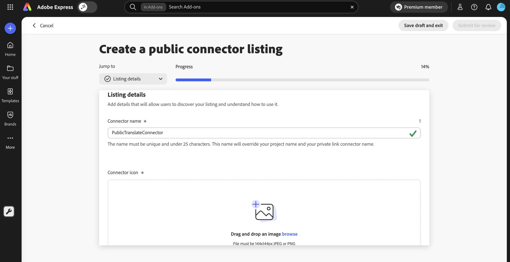

### Step 3: Upload screenshots

Upload 1 to 5 screenshots that show the connector in use inside Adobe Express. The first screenshot appears as the hero image on the connector's listing detail page, so put your strongest screen first.

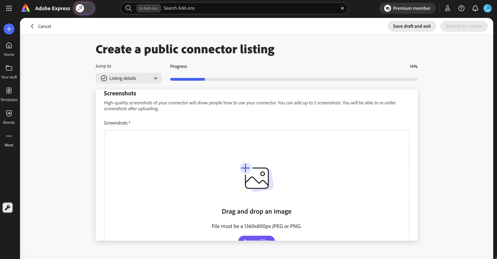

### Step 4: Complete Version details

Upload your connector manifest as a `.json` file, select every language your connector's UI supports, and add **Release notes** for this version. The **Languages supported** list is the languages your connector's UI supports, not the languages the translate service offers. **English (US)** is included by default and cannot be removed.

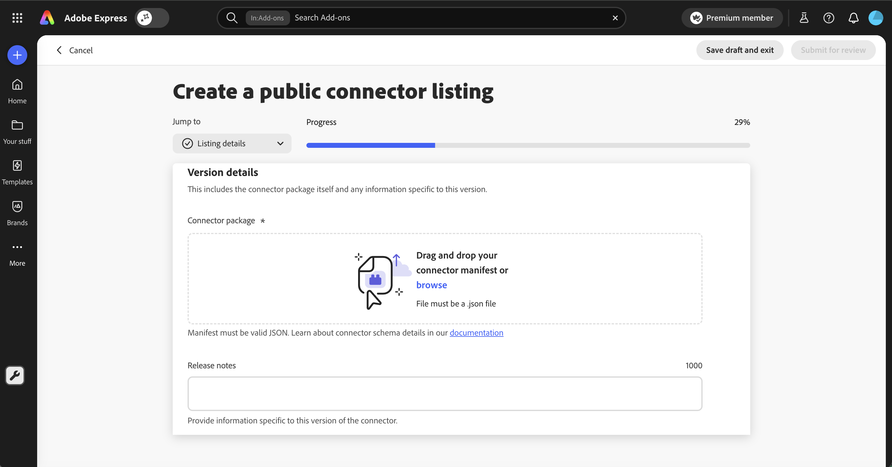

### Step 5: Disclose AI usage

If your connector uses generative AI, you must disclose how. Answer each question in the **AI usage** section truthfully. Reviewers use this information to determine whether your connector meets Adobe's AI policies and to surface AI usage to end users.

If your connector does not use generative AI, you can answer **No** to the entry question and skip the rest of the section.

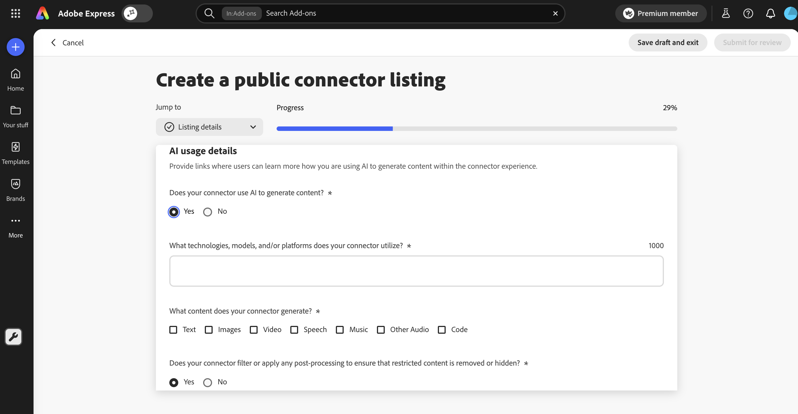

### Step 6: Choose Monetization details

Before you fill in this section, read the [connector monetization guidelines](monetization-guidelines.md). The guidelines cover supported models, payment options, and the patterns Adobe rejects (for example, using "Premium" terminology or attempting to access Adobe Express Premium content from your connector).

Select a monetization model and, if applicable, the payment options your connector supports.

1. Select one **Monetization model**: Free, Free and paid plans available, Free trial, or Paid.
2. If your model is not Free, select one or more **Payment options**: One-time payment, Recurring subscription, or Micro-transactions.
3. Optionally, fill in **Additional details** (up to 250 characters) to describe terms like "7-day free trial" or "$9.99/month".

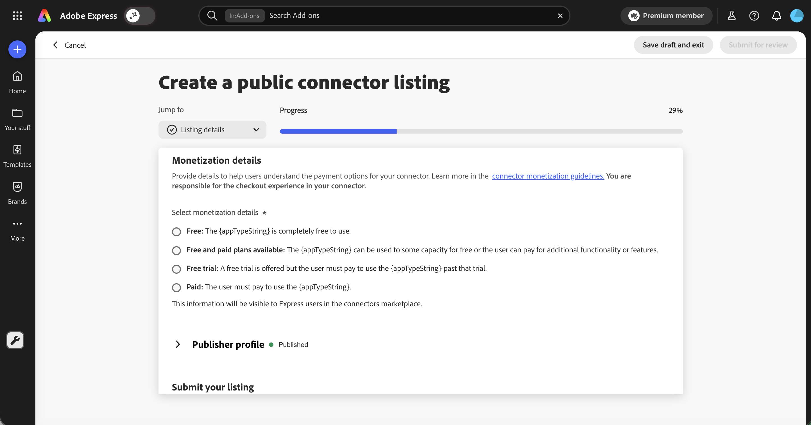

<InlineAlert slots="text" variant="info" />

Adobe Express does not handle checkout for connectors. You build the checkout experience inside your own service or website.

### Step 7: Confirm your Publisher profile and Trader details

Both sections use the same fields as an internal listing:

- For Publisher profile field requirements, see the [Publisher profile](index.md#publisher-profile) field reference.
- For Trader details field requirements and EU compliance behavior, see the [Trader details](index.md#trader-details) field reference.

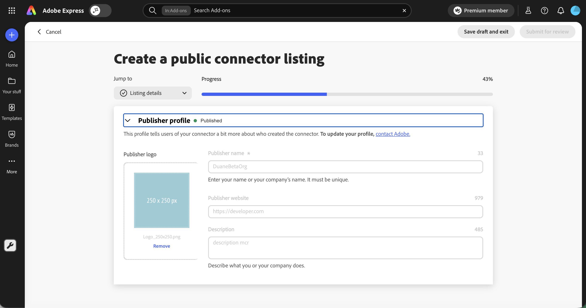

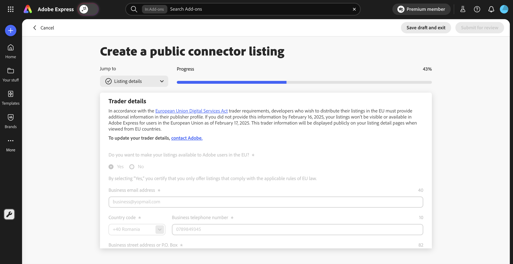

Both sections are locked after submission. To update them later, contact the Adobe Express Translate Connectors team.

### Step 8: Submit for review

1. Review your entries. The **Jump to** dropdown shows checkmarks beside complete sections and the progress bar should read **100%**.
2. Add **Notes to reviewer** with the information the review team needs to sign in and validate your connector. What to include depends on your authentication type (see [Get your connector ready for review](#get-your-connector-ready-for-review)):
   - **Secure API Key:** The Express organization to use for testing (organization name or ID; either works), and test credentials to sign in to Express using that organization, if needed.
   - **OAuth 2.0 PKCE:** Test credentials for your own service to enter in the OAuth modal. The organization the reviewer signs in with doesn't matter.
   - Any additional context, such as coupon codes needed to exercise paid features.
3. Click **Submit for review**, or **Save draft and exit** to finish later.

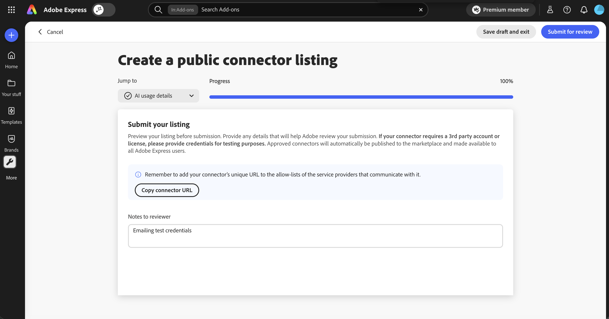

The **Submit for review** button is enabled only when all required fields are valid.

After you click **Submit for review**, a confirmation dialog appears. The review team typically takes 5 to 10 days to review your connector. You receive an email when the review is complete.

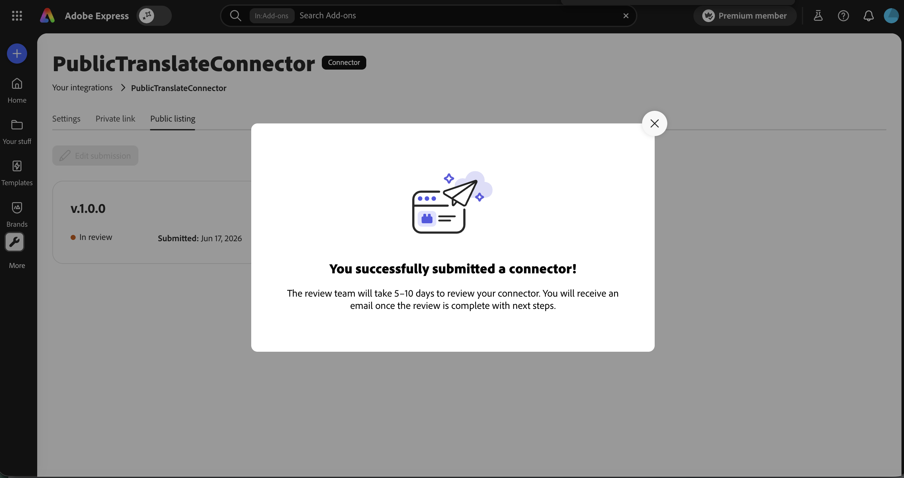

## Prepare your submission

Gather your metadata, assets, and manifest before you open the submission form. Public listings collect the full set of fields, including the public-only Support email address, End User License Agreement (EULA), AI usage disclosure, and monetization details. For field-by-field requirements, character limits, and asset formats, use the consolidated [Listing field reference](index.md#listing-field-reference), including:

- [Listing details](index.md#listing-details)
- [Version details](index.md#version-details)
- [Publisher profile](index.md#publisher-profile)
- [Trader details](index.md#trader-details)
- [AI usage disclosure](index.md#ai-usage-disclosure)
- [Monetization details](index.md#monetization-details)
- [Asset quick reference](index.md#asset-quick-reference)

Review the [connector monetization guidelines](monetization-guidelines.md) before you fill in the monetization details.

## What Adobe reviews

Adobe reviews public connector listings before they're enabled for users. The review covers:

| Area | What reviewers check |
|---|---|
| Manifest | Valid JSON, conforms to the connector manifest schema, has a unique ID and a present version number. |
| Endpoint connectivity | Adobe sends a test payload to your connector's endpoint to confirm it's operational. |
| Listing content | Listing copy is accurate, screenshots reflect actual behavior, help URL works, support email is reachable. |
| Monetization | Pricing claims match the in-product checkout experience. Premium terminology is not used. Adobe Express Premium content is not resold. |
| AI usage | Disclosure is accurate. Generated content does not violate Adobe content policies. |
| Publisher profile | Identity information is complete and accurate. Trader details are valid when provided. |

If a check fails, reviewers contact you through the email on your publisher profile. Drafts you saved earlier remain intact while you correct and resubmit.

## After Adobe approves your listing

Approval means your connector passed review. It is not yet visible to users until Adobe turns on visibility for the organizations you designate.

### Enable your connector for specific enterprises

- **If you registered a Secure API Key before you submitted:** Adobe activates visibility for the same organization(s) you provided during registration (see [Register your Secure API Key with Adobe](index.md#register-your-secure-api-key-with-adobe)) once your listing is approved. You'll get a confirmation email when your connector is live, no further action needed.
- **Otherwise:** Email the Adobe Express Translate Connectors team at [express-connectors-support@adobe.com](mailto:express-connectors-support@adobe.com) with your connector ID and the organization ID(s) or name(s) that should have access. Either identifier works: Adobe can resolve an organization ID from its name, or the reverse.

To add organizations beyond the ones you originally registered, use the same email address with your connector ID and the additional organization ID(s) or name(s).

After Adobe enables the connector, it appears as an option in the Translate service dropdown for Adobe Express users in those enterprises.

### Manage your published connector

- To ship a new version, open the listing under **Your integrations**, upload the new `manifest.json` file under **Version details**, and resubmit. Updates go through Adobe review again.
- Your publisher profile and trader details are locked. To update them, contact the Adobe Express Translate Connectors team at [express-connectors-support@adobe.com](mailto:express-connectors-support@adobe.com).

<InlineAlert slots="text" variant="info" />

After Adobe enables your connector for an enterprise, there may be a short processing period before it appears in the Translate service dropdown for that enterprise's users. If it has not appeared within a few business days, contact the Adobe Express Translate Connectors team at [express-connectors-support@adobe.com](mailto:express-connectors-support@adobe.com).

## Troubleshoot common issues

Public-listing-specific issues are listed below. For shared issues (manifest schema errors, endpoint check failures, EU trader visibility), see the consolidated [Troubleshoot common issues](index.md#troubleshoot-common-issues) table.

| Symptom | Cause | Resolution |
|---|---|---|
| **Public listing** card is missing from the **Publish** tab | Account does not yet have connector submission access, or public listing hasn't been enabled for your organization | Request access using the [Connector interest form](https://airtable.com/appiNBn2w6uT0cpkR/pag3db7joqgtwXSOv/form), or contact the Adobe Express Translate Connectors team. |
| **Submit for review** button stays disabled | Required fields are missing or invalid | Open the **Jump to** dropdown. Incomplete sections aren't marked with a checkmark. |
| Review reports monetization mismatch | Pricing in your listing doesn't match what users see in checkout | Update either the listing or the checkout to match, then resubmit. |
| Reviewer can't sign in or test your connector | Notes to reviewer is missing the Express organization or test credentials, or (for Secure API Key connectors) the key isn't yet registered for the test organization | Add the missing information to **Notes to reviewer** and confirm your Secure API Key registration if applicable (see [Get your connector ready for review](#get-your-connector-ready-for-review)), then resubmit. |
| Connector not appearing in the Translate dropdown after approval | Enablement is still being processed | Allow a few business days after receiving approval. If the connector still has not appeared, contact the Adobe Express Translate Connectors team at [express-connectors-support@adobe.com](mailto:express-connectors-support@adobe.com). |

## Related documentation

- [Submit your Connector](index.md)
- [Connector monetization guidelines](monetization-guidelines.md)
- [Internal listing guide](internal-listing.md)
- [Private share link guide](private-link.md)
- [Connector Playground](../connector-playground.md)
- [Connector manifest schema](../../reference/manifest-schema/index.md)
- [Getting Started](../getting-started.md)
- [FAQ](../../support/faqs/index.md)
- [Troubleshooting](../../support/troubleshooting/index.md)
