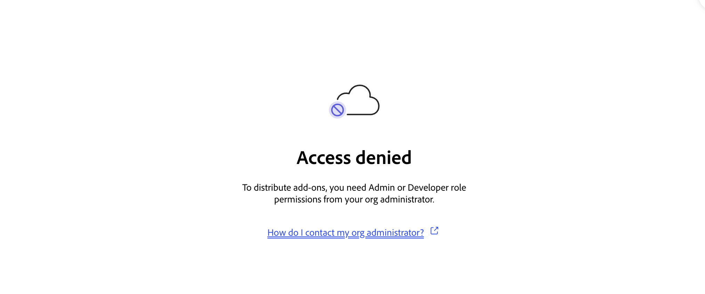

# Troubleshooting Adobe Express Translate Connectors

This page covers common errors and how to resolve them. Errors are grouped by category.

## Manifest Validation Errors

### Missing required field

**Symptom:** Validation fails with a message indicating a required field is absent.

**Resolution:** Check that all required top-level fields are present: `id`, `name`, `type`, `version`, `manifestVersion`, `connectorVersion`, `apps`, and `apiConfig`. See [Manifest Schema Reference](../../reference/manifest-schema/index.md) for the full list.

<HorizontalLine />

### Invalid `manifestVersion` or `connectorVersion`

**Symptom:** Validation fails with an error about `manifestVersion` or `connectorVersion`.

**Resolution:** Both fields must be the number `1`, not a string. Correct:

```json
"manifestVersion": 1,
"connectorVersion": 1
```

Incorrect:

```json
"manifestVersion": "1",
"connectorVersion": "1"
```

<HorizontalLine />

### Invalid connector `type`

**Symptom:** Validation fails with an error that the `type` value is not recognized. The validation error will include an entry like:

```json
{
  "instancePath": "/type",
  "keyword": "enum",
  "params": { "allowedValues": ["Translate"] },
  "message": "must be equal to one of the allowed values"
}
```

**Resolution:** Currently, the only supported type is `"Translate"`. Check for typos, casing, and confirm the value is a string, not a number.

```json
"type": "Translate"
```

<HorizontalLine />

### `apiConfig` is missing required endpoint for connector type

**Symptom:** Validation reports that a required API endpoint is missing.

**Resolution:** Translate connectors require at minimum the `locales` and `translate` entries in `apiConfig`. Add the missing endpoint configuration.

```json
"apiConfig": [
  { "id": "locales", ... },
  { "id": "translate", ... }
]
```

<HorizontalLine />

### Locale picker form input causes a validation error

**Symptom:** Manifest validation fails with an error on the `uiConfig` form input for the locale picker, even though the configuration appears correct.

**Resolution:** The `formInput` entry that displays the locale picker must use `"id": "targetLocale"` exactly. Any other value will fail validation. Check your `uiConfig` and correct the `id`:

```json
{
  "id": "targetLocale",
  "type": "MultiSelectPicker",
  ...
}
```

<HorizontalLine />

### Tone picker causes unexpected behavior in the Translate panel

**Symptom:** The Translate panel behaves unexpectedly after connecting, or tone selection does not work correctly, even though your manifest and service appear to be configured correctly.

**Resolution:** Check whether your `uiConfig` has a `formInput` with `"id": "tone"`. This value conflicts with an internal identifier used by Adobe Express. The tone picker `id` is not enforced by the validator, but use `"tone"` as the convention to match the Playground form builder default:

```json
{
  "id": "tone",
  "type": "Picker",
  ...
}
```

<HorizontalLine />

### Form input requires a `dataSource` but none is defined

**Symptom:** Validation fails with an error about a `Picker` or `MultiSelectPicker` missing a `dataSource`.

**Resolution:** `Picker` and `MultiSelectPicker` form input types require a `dataSource` configuration. Add either a `Static` or `API` source:

```json
"dataSource": {
  "type": "API",
  "apiId": "$api_locales"
}
```

<HorizontalLine />

### Invalid `method` value in `apiConfig`

**Symptom:** Validation fails with an error about the `method` field.

**Resolution:** `method` must be `"GET"` or `"POST"`. Both values are uppercase strings.

```json
"method": "POST"
```

## Authentication Errors

### OAuth authorization popup is blocked

**Symptom:** The authorization popup does not open in the Connector Playground, and a red toast appears reading **"Pop-ups are blocked. Allow pop-ups and try again."**.

**Resolution:** Allow popups from `adobe.com` in your browser settings. In Chrome: **Settings** > **Privacy and security** > **Site settings** > **Pop-ups and redirects** > Add `adobe.com` to the allowed list. After allowing popups, select **Connect** again.

<HorizontalLine />

### OAuth sign-in fails after the popup opens

**Symptom:** The authorization popup opens, but sign-in does not complete and a red toast appears in the Playground reading **"Sign in failed. Try again."**.

**Resolution:** This toast covers any sign-in failure other than a blocked popup or a user-cancelled login. Common causes:

- The `clientId` in `authConfig` is not registered with the authorization server you configured.
- The Adobe Express redirect URIs are not allowlisted on your authorization server. Both must be registered: `https://express.adobe.com/static/oauth-redirect.html` **and** `https://new.express.adobe.com/static/oauth-redirect.html`.
- The authorization server is unreachable, returned an unexpected error, or rejected the request for an unrelated configuration reason.
- The token exchange call to `tokenUrl` failed. See [OAuth token exchange fails](#oauth-token-exchange-fails) below for the most common token-exchange causes.

If a user closes the popup before completing sign-in, the Playground treats it as a cancellation and does not show a toast. Click **Connect** again to retry.

<HorizontalLine />

### OAuth popup shows a "contact the application developer" or "access denied" page

**Symptom:** The OAuth popup opens and the user can sign in, but the provider page then shows a message such as **"Please contact the application developer to gain access to \<app name\>"** (Adobe IMS), **"Access denied"** (Auth0), or an equivalent message from another provider. The popup stays open and no toast appears in the Connector Playground.

**Cause:** The user authenticated successfully but the authorization server is refusing to authorize them for your specific OAuth application. This is a provider-side access decision, not an Adobe Express error, which is why the Playground does not surface a separate toast: the popup never closes with an error code that Adobe Express can act on.

**Resolution:** Adjust your OAuth application's authorization rules at the provider:

- Add the user (or the user's group, organization, or domain) to your application's allowed-users list, allowed-organizations list, or equivalent setting.
- Confirm any role, group, or claim requirements your application enforces are satisfied by the user's profile.
- If you use the Adobe IMS authorization server for internal testing, ask the application owner to add the user to the IMS application's entitlement list.

After updating the provider, ask the user to close the popup, then select **Connect** again.

<HorizontalLine />

### OAuth token exchange fails

**Symptom:** The Playground shows an authentication error after the authorization code is received.

**Resolution:** Verify the following:

- Your `tokenUrl` is correct and reachable.
- Your authorization server accepts the authorization code and returns a valid access token.
- Your `clientId` matches the client registered with your authorization server.
- Your authorization server supports the PKCE flow with `code_challenge_method=S256` (SHA-256). Adobe Express always uses S256; `plain` is not supported.
- Adobe Express sends the token request as a `POST` with a `multipart/form-data` body, not `application/x-www-form-urlencoded`. Major hosted providers (Auth0, Okta, Azure AD) accept both, but custom or self-hosted OAuth servers may need to be configured to accept `multipart/form-data`. The fields sent are: `grant_type`, `client_id`, `code`, `redirect_uri`, and `code_verifier`. `client_secret` is not included.

**Token refresh failures:** Adobe Express automatically refreshes expired access tokens by sending a `POST` to your `tokenUrl` with `grant_type=refresh_token`, `client_id`, and `refresh_token` (also as `multipart/form-data`, without `client_secret`). If users are repeatedly prompted to re-authorize, verify that your authorization server accepts public client refresh requests and returns a valid new access token.

<HorizontalLine />

### Connector returns `Unauthorized` error

**Symptom:** The Connector Playground shows an authentication error, or your service logs indicate missing or invalid credentials.

**Resolution:**

- Confirm `useAuth: true` is set on the endpoint in `apiConfig`.
- Confirm `authConfig` is configured correctly in the manifest.
- If using **OAuth 2.0 PKCE**, verify that your service validates the `Authorization: Bearer` header and returns HTTP `401` with `{ "errorCode": "Unauthorized" }` in the body when credentials are missing or invalid.
- If using **plain API Key**, confirm two things: (1) the `$apiKey` placeholder appears as a header value in `apiConfig.headers` (for example, `"x-api-key": "$apiKey"`), and (2) your service reads the key from that same header name. Without the `$apiKey` placeholder in your endpoint config, the key is never sent. Plain API Key is supported for development and end-to-end testing only; see [Endpoint Setup: authentication options](../../guides/endpoint-setup.md#choose-your-authentication-type) for what's approved for production.

<HorizontalLine />

### Connector returns 401 or 403 when using Secure API Key

**Symptom:** Your service returns `401` or `403` on translation requests after configuring Secure API Key authentication, even though the same endpoint works with a direct curl.

**Resolution:**

- Confirm the header name in `apiConfig.headers` matches the header your backend reads. If your manifest declares `"headers": { "x-api-key": "$secureApiKey" }`, your service must read `req.headers["x-api-key"]`, not `req.headers["authorization"]`.
- Confirm `useAuth: true` is set on the endpoint in `apiConfig`.
- Verify that the key value Adobe registered for your org matches the key your service validates. Contact [express-connectors-support@adobe.com](mailto:express-connectors-support@adobe.com) if you need to confirm or update the registered key.

<HorizontalLine />

### 502 or 504 on a Secure API Key connector

**Symptom:** Translation requests fail with a 502 or 504 error in the Connector Playground when using Secure API Key authentication.

**Cause:** Adobe's secure bridge could not successfully forward the request to your service. The two codes indicate different failure modes:

- **502 Bad Gateway**: the bridge reached your host but received an error response or no valid HTTP response. Usually a connectivity failure, bad TLS certificate, or the service is not listening.
- **504 Gateway Timeout**: your service received the request but did not respond within the time limit (30 seconds). The bridge also returns 504 if the connection was reset (`ECONNRESET`) before a response arrived.

**Resolution:**

- Confirm your endpoint URL in `apiConfig` is correct and the service is running.
- Confirm your service is served over HTTPS with a valid, publicly trusted TLS certificate. The bridge requires HTTPS and rejects self-signed or expired certificates.
- Check your server logs. If no incoming request appears at all, the issue is upstream of your service. Verify DNS resolution, firewall rules, and that the host is reachable from outside your local network.
- If you see the request in your logs but it times out, confirm your service responds within 30 seconds. For computationally expensive translations, ensure your service does not block the event loop and returns a response promptly.

<HorizontalLine />

### Translation fails for a specific user or org with Secure API Key

**Symptom:** Some users see an authentication error while others succeed, or all users fail after providing your key to Adobe. When testing directly against the bridge, you receive HTTP 400 with `APP_SECRET_NOT_FOUND`.

**Cause:** There are two distinct reasons the bridge returns this error:

1. **Connector ID mismatch**: Adobe registers secrets by Connector ID, the subdomain segment of your Connector URL shown in the Settings tab of your integration. This is a different value from the `id` field in your connector manifest, which the Connector Playground generates separately and which Adobe does not use for registration. If the Connector ID Adobe used during registration doesn't exactly match your integration's current Connector ID, the lookup fails for all users and all orgs. This is the most common cause when all users fail.
2. **Org not in the mapping**: The user's Adobe org ID is not included in the key mapping Adobe registered for your connector. This is the common cause when some users succeed and others fail.

**Resolution:**

- Open the **Settings** tab for your integration and confirm the Connector ID (the first segment of your Connector URL) exactly matches what you sent Adobe when registering your key. Capitalization and hyphens matter. Don't confuse this with the `id` field in your manifest.
- To avoid transcription mismatches like this, share the full Connector URL (copied with the **Copy** button) instead of retyping just the ID. Adobe derives the Connector ID from the URL you paste.
- Contact [express-connectors-support@adobe.com](mailto:express-connectors-support@adobe.com) to verify or update the registration. Provide your Connector URL, the Adobe org IDs that should be authorized, and whether the key should apply to all orgs (global mapping). If you need to share an updated key value, use a secure-sharing tool of your choice. Never paste it into the email.

<HorizontalLine />

## API Response Errors

### `/locales` returns an empty array or no response

**Symptom:** The language picker in the Playground is empty or does not populate.

**Resolution:**

- Confirm your `/locales` endpoint is running and reachable.
- Confirm the response includes a `locales` array with at least one entry.
- Confirm each locale object includes `code` and `label` fields.
- Check the browser network tab in the Playground for the raw request and response.

<HorizontalLine />

### Locale or tone picker shows stale options after updating your service

**Symptom:** You updated your `/locales` or `/tones` endpoint response (for example, added or removed options), but the picker in the Translate panel still shows the old data after reconnecting.

**Resolution:** Adobe Express caches `/locales` and `/tones` responses in memory for the current session. Reconnecting alone does not clear this cache. Do a hard reload of Adobe Express (`Cmd+Shift+R` on Mac, `Ctrl+Shift+R` on Windows), then select **Connect** in the Connector Playground again. The fresh page load forces a new call to your endpoints.

<HorizontalLine />

### `/translate` returns wrong number of results

**Symptom:** The translation result in the Playground is missing items or items are in the wrong order.

**Resolution:** Your `/translate` endpoint must return a `result` array with the same number of items as the `items` array in the request, in the same order. Do not skip or merge items.

**Example:** If the request contains three items, the response must contain exactly three translated strings.

<HorizontalLine />

### `/translate` returns an error code

**Symptom:** The Playground shows a translate error message.

**Resolution:** Check the `errorCode` value in the response and refer to the table below:

| Error Code | Meaning | Fix |
|------------|---------|-----|
| `UnsupportedLocale` | The requested target locale is not supported. | Return only the locales your service supports from `/locales`. |
| `SourceTargetLocaleSame` | Source and target locale are the same. | Validate input before sending to your translation engine. |
| `UnsafeSourceContentDetected` | The input content was flagged as unsafe. | Implement content safety checks in your service. |
| `InputTokenLimitExceeded` | The input exceeds the token limit. | Return a clear limit in your API documentation and handle oversized inputs gracefully. |
| `ServiceCapacity` | The service is at capacity. | Implement retry logic and respond with this code when load shedding. |
| `MaxSizeExceeded` | The request payload is too large. | Enforce and document request size limits. |
| `BadRequest` | The request body is malformed or missing required fields. | Validate inputs before processing. |
| `Unauthorized` | The request is not authenticated. | Check `useAuth` and `authConfig` settings. |
| `GenericError` | An unexpected server error occurred. | Check server logs for the root cause. |

<HorizontalLine />

## Connector Playground Issues

### Connector Playground is not visible in Adobe Express

**Symptom:** You cannot find the Connector Playground toggle in Adobe Express.

**Resolution:** The Connector Playground toggle is located in the **Add-on Development** section at the bottom of the Add-ons panel. To access it, click the **Add-ons** icon in the left rail, select the **Your add-ons** tab, and scroll to the bottom of the panel. The toggle is only visible to enterprise Adobe accounts with a Developer or Administrator role, or personal accounts approved through the [Connector interest form](https://airtable.com/appiNBn2w6uT0cpkR/pag3db7joqgtwXSOv/form). You must also be signed in with the **same Adobe account email** that has access. Signing in with a different account is the most common cause of this issue.

You can also enable Add-on Development mode manually through Adobe Express Settings:

<Details slots="heading, list" repeat="1" summary="Click to view steps to manually enable Add-on Development mode" />

- Steps:
  1. Open Adobe Express in your browser and click the **avatar icon** in the top right corner.
  2. Click the **gear icon** to open **Settings**.
  3. Click the **Developer Terms of Use** link to review the terms (opens in a new tab) if you haven't already.
  4. Click **Accept and Enable** to enable **Add-on Development**.

If the problem persists after confirming your account, contact [express-connectors-support@adobe.com](mailto:express-connectors-support@adobe.com).

<HorizontalLine />

### Access Denied dialog appears when enabling Add-on Development

**Symptom:** When trying to enable Add-on Development mode, an **Access denied** dialog appears saying you need Admin or Developer role permissions.



**Resolution:** Your Adobe account must have either an **Administrator** or **Developer** role assigned by your organization's Adobe administrator before you can enable Add-on Development mode. Contact your organization's Adobe admin to request the appropriate role. If you are unsure who your administrator is, use the following link to find out:

[How do I contact my org administrator?](https://helpx.adobe.com/enterprise/kb/contact-administrator.html)

The same role is required to [submit your connector](../../guides/submission/index.md) for distribution.

<HorizontalLine />

### Manifest does not load in the Playground

**Symptom:** The Playground shows a validation error after filling in the form builder fields.

**Resolution:**

1. Confirm all required fields in the **General** and **API Configuration** sections are filled in correctly.
2. Confirm all required fields are present (see [Manifest Schema Reference](../../reference/manifest-schema/index.md)).
3. Review the generated JSON in the right-side panel. It highlights the field that failed validation.

<HorizontalLine />

### Endpoint tester shows "Request failed" when pointing at an `http://localhost` URL

**Symptom:** Each endpoint in the **API Configuration** section shows a red "Request failed" tooltip after you select **Connect**, even though your service is running locally and `curl http://localhost:8787/health` works from your terminal.

**Cause:** Adobe Express runs over HTTPS and the Playground's endpoint tester calls your service directly from the browser. Plain `http://localhost` URLs may work in Chrome and Edge as a development convenience, but they are not portable. Common reasons the request fails:

- **Browser mixed-content rules:** Safari blocks any request from an HTTPS page to an `http://` address, including `http://localhost`. Firefox carves out `localhost` and `127.0.0.1` but applies stricter rules to subresources. Chrome and Edge are the most permissive. Behavior can also differ across Adobe Express environments and browser versions, so an `http://localhost` URL that works in one setup may fail in another.
- **CORS:** Even if the request fires, your service must return `Access-Control-Allow-Origin` for the Adobe Express origin (or `*` during development) on every endpoint, including preflight `OPTIONS` responses. See [Enable CORS for Playground testing](../../guides/endpoint-setup.md#enable-cors-for-playground-testing).

**Resolution:** Expose your local service over HTTPS, then enter the HTTPS URL in the API Configuration form. Common options:

- A tunneling tool such as [ngrok](https://ngrok.com/), [Cloudflare Tunnel](https://developers.cloudflare.com/cloudflare-one/networks/connectors/cloudflare-tunnel/), or `cloudflared`, each of which provides a public HTTPS URL that forwards to your local port.
- A local HTTPS reverse proxy with a trusted certificate, for example [mkcert](https://github.com/FiloSottile/mkcert) paired with Caddy or nginx.

If you are configuring OAuth 2.0 PKCE, use the same HTTPS hostname for `authorizationUrl` and `tokenUrl`. See [HTTPS Requirements](../../guides/endpoint-setup.md#https-requirements) for the full rationale.

<HorizontalLine />

### Playground does not call my `/locales` endpoint

**Symptom:** The Playground connects but the locale picker is empty and no request appears in the server logs.

**Resolution:**

- Confirm the `locales` entry is present in `apiConfig`.
- Confirm the `uiConfig` includes a form input with `"dataSource": { "type": "API", "apiId": "$api_locales" }`.
- Confirm `useAuth` is set correctly on the `locales` endpoint.

<HorizontalLine />

### Session state is lost after refreshing the Playground

**Symptom:** The manifest and connection state are not restored after a page refresh.

**Resolution:** This behavior may occur if you are signed in to multiple Adobe accounts or if your browser blocks cookies for `adobe.com`. Ensure you are signed in to Adobe Express with the correct account and that cookies are allowed.

<HorizontalLine />

## Submission errors

### Connector submission issues

**Symptom:** **Connector** is not offered as an integration type in the **Create new integration** dialog, a distribution card (**Internal listing** or **Public listing**) is missing or disabled in the **Publish** tab, or you hit an error while completing a submission form (name conflicts, manifest validation, endpoint connectivity checks, EU visibility, monetization mismatches).

**Resolution:** See the consolidated [Troubleshoot common issues](../../guides/submission/index.md#troubleshoot-common-issues) table in Submit your Connector, which covers every submission symptom across all three distribution paths and flags which paths each one applies to.

## Contact Support

If you cannot resolve an issue using this guide, contact the Adobe Express Translate Connectors team at [express-connectors-support@adobe.com](mailto:express-connectors-support@adobe.com). Include:

- Your connector ID
- A description of the issue
- The manifest JSON (with sensitive credentials removed)
- Any error messages from the Playground or your server logs
